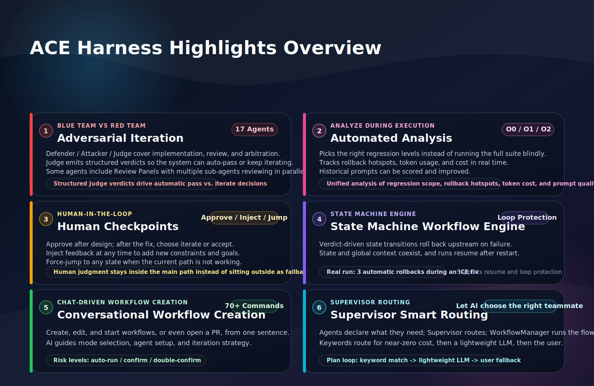
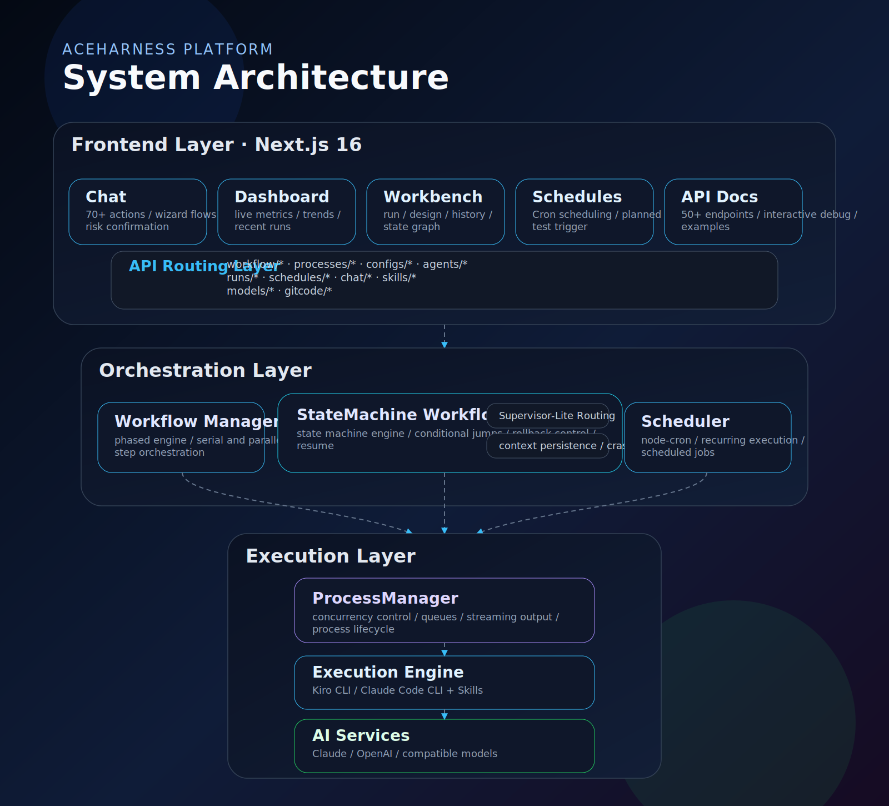
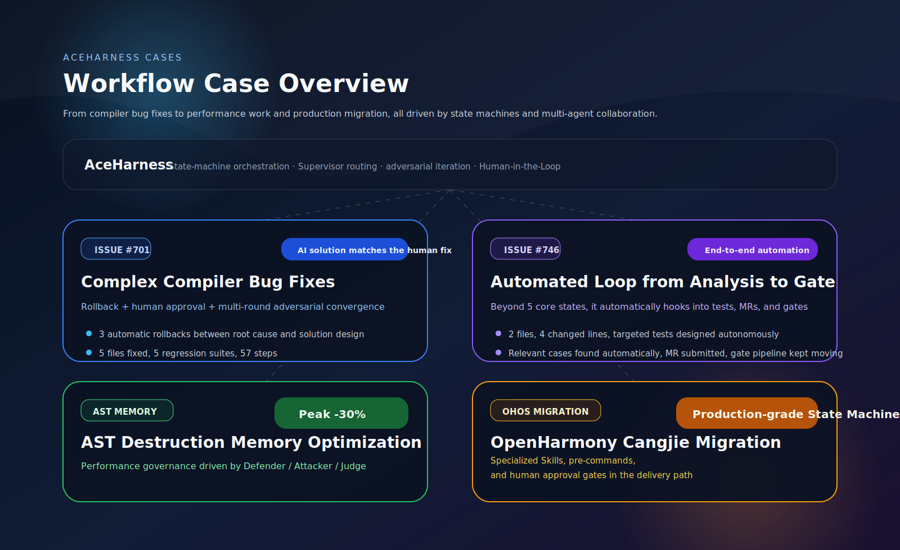
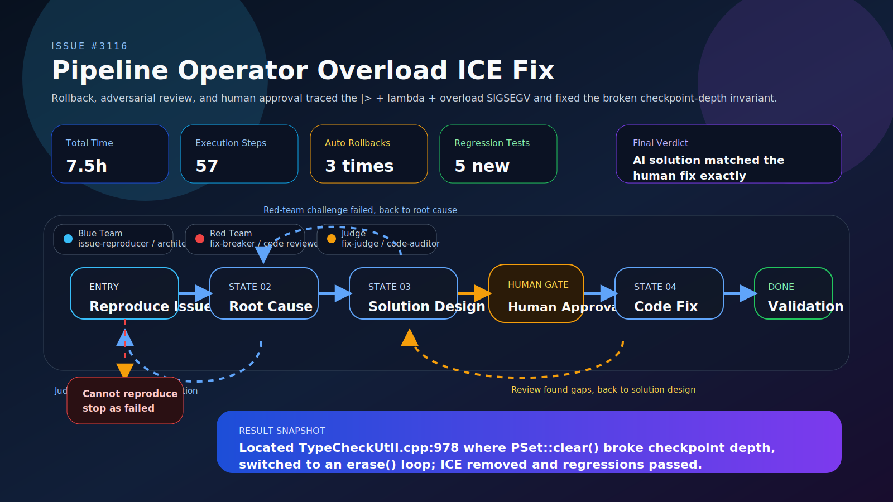
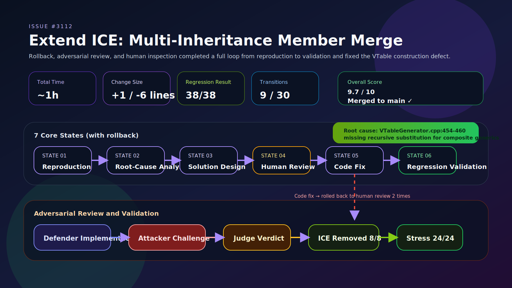
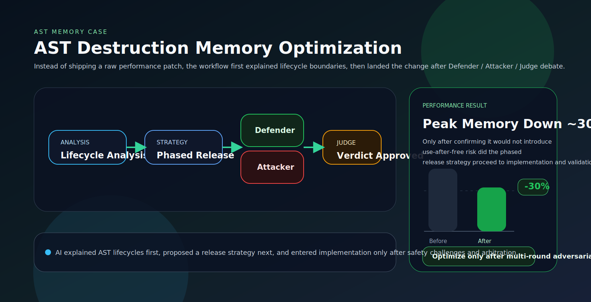
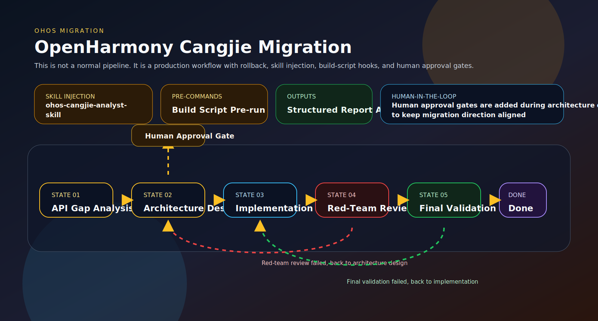

<div align="center">

# ACE Harness (Agent Centric Engineering Harness)

English | [中文](./README.md)

<picture>
    <source media="(prefers-color-scheme: dark)" srcset="./public/logo.png">
    
</picture>

***Built by the Cangjie Team***

***An enterprise-grade AI multi-agent collaboration system powered by state machines / Supervisor routing / adversarial iteration / conversational creation***


Your team of AIs, collaborating to get work done.

<picture>
    <source media="(prefers-color-scheme: dark)" srcset="./public/images/features-overview.en.svg">
    
</picture>

</div>

---

## Table of Contents

- [Quick Start](#quick-start)
- [Highlights](#highlights)
- [Architecture](#architecture)
- [Functional Modules](#functional-modules)
- [Workflow Cases](#workflow-cases)
- [Configuration and Engines](#configuration-and-engines)
- [Tech Stack](#tech-stack)
- [Contributing](#contributing)

---

## Quick Start

### Requirements

- Node.js >= 20 / npm >= 9
- `claude-code` / `kiro-cli` / `opencode` / `cursor-cli` / `codex` / `trae-cli` / `Cangjie Magic`

### Install and Run

Get started quickly:

```bash
npm install -g @cangjielang/aceharness

# Start:
ace
# ✔ Please select a language › English
# [ACE] Welcome. First launch will initialize local runtime settings.
# ...
# [ACE] Starting server: http://127.0.0.1:3000
# [ACEHarness] Server ready on http://0.0.0.0:3000
# [ACE] Open http://127.0.0.1:3000 in your browser

# Reset account password, engine settings, etc.:
ace reset --force
# ...
# [ACE] Reset complete. The next `ace` run will initialize again.
```

If you are a developer:

```bash
git clone <repository-url> && cd aceharness

# Install dependencies after the first clone or after updates
npm install

# Local development (no build required)
npm run dev  # Custom port: npm run dev -- -p 8080

# Production mode (run build again after the first clone or after updates)
npm run build
npm start # Custom port: npm start -- -p 8080
```

---

## Highlights

### 1. Adversarial Iteration: Blue Team vs Red Team

Each workflow stage can define three roles:

| Role | Responsibility | Example Agents |
|------|------|-----------|
| **Defender** (Blue Team) | Implement features and write code | architect, developer, fix-hunter, ... |
| **Attacker** (Red Team) | Review quality and find defects | fix-breaker, design-breaker, stress-tester, ... |
| **Judge** | Arbitrate both sides and output a verdict | fix-judge, code-judge, design-judge, ... |

The Judge produces a structured verdict, and the system decides whether to pass or continue iterating:

```json
{ "verdict": "fail", "remaining_issues": 3, "summary": "Edge cases are still uncovered" }
```

ACEHarness ships with 17 built-in specialized agents spanning architecture design, implementation, security auditing, performance testing, and more. Some agents also include a Review Panel mode, where multiple sub-agents review in parallel from different angles.

### 2. Automated Analysis: More Than Just Running Tasks

The system does not merely "run agents in order". It analyzes execution as it goes:

- **Regression test decisions**: automatically determines which tests to run for O0/O1/O2 optimization levels instead of always running the full suite
- **Rollback-path analysis**: visualizes rollback counts and hot states in the transition graph to help identify workflow bottlenecks
- **Cost tracking**: records token usage and cost for every step, enabling cost optimization decisions
- **Prompt analysis**: evaluates historical prompts and suggests quality improvements

### 3. Human-in-the-Loop Checkpoints

Critical decisions can be guarded by manual approval gates:

- Confirm whether coding should begin after design is completed
- Decide whether to continue iterating or accept the result after a code fix
- Support **feedback injection**: add extra instructions to the agent at any time during iteration
- Support **forced jumps**: jump directly to any state if the current path is unsatisfactory

### 4. State Machine Workflow Engine: Beyond Linear Pipelines

Traditional AI workflows tend to run from start to finish linearly. ACEHarness introduces a **finite-state machine** model where every state can decide the next step dynamically based on the agent's structured verdict:


- **Conditional transitions**: when an agent outputs `{"verdict": "fail"}`, the workflow can automatically roll back to an upstream state for re-analysis
- **Maximum transition protection**: prevents infinite loops, such as `maxTransitions: 50`
- **State-scoped context**: each state maintains its own context while also sharing global information
- **Crash recovery**: after a service restart, interrupted runs are detected automatically and can resume from checkpoints

In real execution logs, when fixing a compiler ICE issue, the workflow automatically rolled back **three times** between root-cause analysis and solution design before moving forward with the actual fix. That is the practical value of a state-machine workflow.

### 5. Conversational Workflow Creation: Build It by Saying It

The chat interface on the home page is not just for conversation. It includes **70+ action commands** that cover the full workflow lifecycle:

- "Help me create a workflow to fix Issue #3116" — AI guides you through mode selection, agent configuration, and iteration strategy
- "Switch fix-hunter to opus" — updates the agent configuration directly
- "Start the oh-cangjiedev-sm workflow" — launches with one command
- "Help me submit a PR with the title ..." — integrates GitCode operations

Actions in the conversation are classified by risk level: safe operations run automatically, change operations require confirmation, and destructive operations require a second confirmation.

### 6. Supervisor Smart Routing: Let AI Decide Who Should Work on What

**The core problem**: in traditional multi-agent workflows, agents execute in a fixed sequence and passively consume upstream output. When information is missing, they can only guess, and humans must iterate after poor results. In other words, agents do not know what they do not know, and they have no proactive way to ask the right teammate.

**Architecture**: ACEHarness includes a Supervisor-Lite architecture that separates collaboration into three layers of responsibility:

- **Agent** declares only what information it needs through the `[NEED_INFO]` protocol, without knowing the team roster
- **Supervisor** performs routing only, moving from keyword matching to lightweight LLM routing and then to user fallback when needed
- **WorkflowManager** handles state transitions and persistence only, without making routing decisions

Routing happens in two layers: keyword hits route with near-zero cost, lightweight semantic routing runs only when needed, and the final fallback asks the user. The entire process is embedded in a configurable Plan loop so the agent executes only after it has enough information.

**Key advantages**:

- **Agent-agnostic collaboration**: prompts do not include an injected agent list, so each agent stays focused on its own domain while routing is delegated entirely to Supervisor
- **Near-zero routing cost**: most routing is handled by keyword matching, and a single LLM routing decision costs roughly $0.001, much cheaper than reruns caused by missing information
- **Breaks linear information flow**: an analyst can actively consult an implementation expert mid-execution instead of waiting for that expert's turn in the sequence
- **Progressive, zero-intrusion adoption**: add one line such as `enablePlanLoop: true` to a step to enable it; leave it out and the original execution path is unchanged. A three-level fallback prevents deadlock

The Supervisor view in the workbench can replay every decision round and clearly show why a route was chosen.

---

## Architecture



Notes:
- Real-time communication uses SSE to push execution status to the frontend
- Persistent data is stored under `runs/{runId}/`, including state, output, and streamed content

## Functional Modules

### Chat Page (`/`)

The main entry point. Use conversation to drive the full workflow lifecycle: create configurations, manage agents, start runs, inspect results, and submit PRs without leaving the chat flow.

Supports streamed output, session persistence, model switching, action confirmation/undo, and wizard-style guidance for step-by-step workflow and agent creation.


### Dashboard (`/dashboard`)

The global view. Displays key metrics such as total runs, success rate, average duration, and active workflow count. Also includes 24-hour performance trends, 7-day activity charts, and one-click restore for recent runs.


### Workbench (`/workbench/[config]`)

The core workspace, with three view modes:

**Run view**: the real-time monitoring panel after a workflow starts:
- The flow graph highlights the currently executing node in real time
- Step output is rendered as Markdown with code highlighting
- Live stream panel: inspect in-progress agent output and inject feedback or interrupt at any time
- Human checkpoint dialog: approve / continue iterating with feedback / reject
- Emergency controls such as force complete and force jump

State-machine mode adds six visualization views:
- **Overview**: runtime stats panel and recent transition preview
- **Sequence**: transition history displayed on a timeline
- **Transitions**: state visit counts, rollback paths, and hot-state analysis
- **Supervisor**: questions and routing decisions for each round
- **Agent Flow**: message passing and collaboration between agents
- **State Graph**: ReactFlow topology with the active execution path highlighted in real time

**Design view**: visually edit workflows:
- Drag to reorder steps, configure parallel groups, and define iteration strategies
- Generate YAML configuration in real time with Zod schema validation
- Move steps across stages


**History view**: manage execution history:
- Filter by status and delete in batches
- Inspect full output files and documents for every run
- Prompt analysis for evaluating historical prompt quality


### Workflow Management (`/workflows`)

Create, read, update, and delete workflow configurations. Uses a card-based layout with search, duplicate, and new-workflow wizard support.


### Scheduled Jobs (`/schedules`)

Cron-based scheduling. Supports simple modes such as hourly/daily/weekly as well as custom Cron expressions, with manual trigger testing.

### Skills Management (`/skills`)

A dual-source Skill repository: community-maintained Cangjie Skills and official Anthropic Skills. Supports one-click sync, tag filtering, and detail inspection. Includes 10+ built-in Skills for knowledge retrieval, Excel processing, web testing, MCP building, GitCode operations, document collaboration, and more.

### Model Management (`/models`)

Configure the AI model list with drag-and-drop ordering, custom display names, rate multipliers, and API endpoints.

### API Docs (`/api-docs`)

Built-in interactive API documentation covering 50+ endpoints across 10 categories, including workflow control, configuration management, run records, agents, processes, scheduled jobs, chat, and GitCode.

---

## Workflow Cases

### Workflow Overview



### Case 1: Issue #3116 - Pipeline Operator Overload ICE: SIGSEGV from `|>` + lambda + overload resolution

**Scenario**: the Cangjie compiler triggers an ICE (Internal Compiler Error) when the pipeline operator `|>` is combined with a trailing lambda that calls an overloaded function. The process crashes with SIGSEGV (signal 11) and exit code 139.

**Real-world case**:
- Community issue: [Issue #3116](https://gitcode.com/Cangjie/UsersForum/issues/3116)
- Fix PR: [cangjie_compiler#1405](https://gitcode.com/Cangjie/cangjie_compiler/pull/1405) ✅ merged
- Test PR: [cangjie_test#1387](https://gitcode.com/Cangjie/cangjie_test/pull/1387) ✅ merged

**Triggering code**:
```cangjie
import std.collection.map
func test(input: Array<Float64>) { input |> map { p => f(p + 1.0) } }
func f(float: Float64) { float }
func f(int: Int64) { int }
main() { 0 }
```

**Workflow structure** (state-machine mode, 5 states, up to 30 transitions):



#### Core Design 1: Four-condition trigger analysis and minimal reproduction

The workflow first used variant testing to identify the necessary and sufficient trigger conditions. All four had to be present:
- **Pipeline operator `|>`**: passes the expression as the first argument to the function on the right-hand side
- **Trailing lambda**: `{ p => ... }` is used as an additional argument to the pipeline target function
- **Overloaded function call**: the lambda body calls an overloaded function `f`
- **Lambda parameter without type annotation**: `p` has no explicit type and must be inferred by the compiler

Control case: when the lambda parameter is explicitly typed, the compiler does not crash and instead reports a semantic error:
```cangjie
func test(input: Array<Float64>) { input |> map { p: Float64 => f(p + 1.0) }}
```

#### Core Design 2: Precisely locating the crashing path

Through adversarial root-cause analysis, the exact crash path was identified:
```
TypeCheckLambda
  → TryEnforceCandidate (TypeCheckUtil.cpp:978)
    → PSet::clear()  ← root cause: destroys log/stashes checkpoint layers and resets depth to 1
  → CommitScope destructor
    → PSet::apply()
      → stashes.back() out-of-bounds access  ← SIGSEGV
```

- Total time: **about 5.5 hours**, with **8 transitions** completed out of 30

**Root cause**: at line 978 of `TypeCheckUtil.cpp`, `TryEnforceCandidate` called `tyMgr.constraints[&tv].sum.clear()`. `PSet<T>::clear()` is destructive: it calls `log.clear()` and `stashes.clear()`, resetting checkpoint depth to 1. Other PSet members in the same constraint (such as `lbs`, `ubs`, and `eq`) remained at their original depth (3+). When the `CommitScope` destructor later traversed constraints and called `apply()`, the depth-1 `sum` attempted `stashes.back()` even though its `stashes` state had already been cleared or mismatched, causing out-of-bounds access and SIGSEGV.

#### Core Design 3: Minimal-invasive fix by preserving the checkpoint-depth invariant

The fix replaced destructive `clear()` with an `erase()` loop:

```diff
-        tyMgr.constraints[&tv].sum.clear();
+        auto& sum = tyMgr.constraints[&tv].sum;
+        while (!sum.raw().empty()) {
+            sum.erase(sum.raw().begin());
+        }
```

**Why it works**:
- `clear()`: destroys `log` and `stashes`, resetting depth to 1 ❌
- `erase()` loop: each erase records itself through `checkOut()` in the active checkpoint, preserving consistent depth ✅

This is semantically equivalent to `clear()` because the set is emptied and then repopulated by `AddSumByCtor`, but it preserves the checkpoint-depth invariant.

#### Core Design 4: Comprehensive validation: ICE removal + regression coverage + LLT tests

**ICE removal validation**:
- Original reproduction (pipe + lambda + overload): exit 139 → exit 1 (semantic error) ✅
- Minimal reproduction V17 (no pipe): exit 139 → exit 1 (semantic error) ✅
- Triple-overload variant: exit 139 → exit 1 (semantic error) ✅

After the fix, the compiler reports a clear semantic error, "parameters of this lambda expression must have type annotations", instead of crashing.

**Functional regression validation**:
- Basic pipeline behavior (`5 |> double`): ✅ works
- Overload resolution (`f(1.0)` / `f(1)`): ✅ correct
- Pipeline + lambda without overload: ✅ works
- Lambda with explicit type annotations: ✅ works

**LLT test suite**: 240/240 passed
- New ICE suite (`sema_lambda_overload_ice`): 8/8 ✅
- Existing overload tests: 15/15 ✅
- Existing `sema_test` diagnostic tests: 35/35 ✅
- Existing `flow_expr` pipeline tests: 23/23 ✅
- Existing lambda tests: 74/74 ✅
- Existing call tests: 85/85 ✅

**Eight new LLT cases** (`cangjie_test/testsuites/LLT/compiler/Diagnose/sema_test/sema_lambda_overload_ice/`):
- `case1.cj`: original reproduction (pipe + trailing lambda + double overload)
- `case2.cj`: no pipe (direct lambda assignment + double overload)
- `case3.cj`: triple-overload function
- `case4.cj`: nested lambda + overload
- `case5.cj`: multi-parameter lambda + overload
- `case6.cj`: chained pipeline + overload
- `case7.cj`: multiple overloads combined with type conversion
- `case8.cj`: stress test (deep nesting + multiple overloads)

#### Core Design 5: Multi-round root-cause iteration and conditional approval

The workflow visited the root-cause-analysis stage **six times** in total, including **two conditional approvals**. Through multiple rounds of iteration, it converged on the exact crash path and root cause. This demonstrates the rollback-and-iterate capability of a state-machine workflow and why it improves root-cause accuracy.

#### Execution Data

Real execution data:

- Total time: **about 7.5 hours**, with **6 transitions** completed out of 30
- **State visit stats**: root-cause analysis 6 times (including 2 conditional approvals), fix implementation 2 times, validation testing 2 times
- **Code change**: -1/+3 lines in `src/Sema/TypeCheckUtil.cpp`
- **Root cause**: `PSet::clear()` at `TypeCheckUtil.cpp:978` broke the checkpoint-depth invariant
- **Fix**: replaced it with an `erase()` loop to preserve checkpoint depth
- **Validation results**:
  - ICE removal validation: 3/3 passed (original, minimal, triple-overload)
  - Functional regression validation: 4/4 passed (pipeline, overload, lambda, type annotations)
  - LLT test suite: 240/240 PASS
  - New test cases: 8
  - Stress tests: 4/4 passed (zero crashes)
- **Status**: ✅ merged into the main branch

PR: https://gitcode.com/Cangjie/cangjie_compiler/pull/1405

### Case 2: Issue #3112 - Extend ICE: SIGSEGV from member merge on multi-inheritance paths

**Scenario**: the Cangjie compiler triggered an ICE when processing two `extend` blocks that both extended an interface hierarchy containing same-named member functions. On Windows this surfaced as error code 11 (SIGSEGV).

**Real-world case**:
- Issue report: [Issue #3112](https://gitcode.com/Cangjie/UsersForum/issues/3112)
- Fix PR: [cangjie_compiler#1371](https://gitcode.com/Cangjie/cangjie_compiler/pull/1371) ✅ merged
- Test PR: [cangjie_test#1341](https://gitcode.com/Cangjie/cangjie_test/pull/1341) ✅ merged

**Workflow structure** (state-machine mode, 7 states, up to 30 transitions):



#### Core Design 1: Building the minimal reproduction and confirming trigger conditions

The workflow first built a minimal reproducible case and used variant testing to determine the necessary and sufficient trigger conditions:
- Two `extend` declarations extend the same class `C<A>`
- The extended interfaces are related by inheritance (`I1<T> <: I0<T>`), and the parent interface `I0` contains a default method `f`
- The type parameter is a composite generic type such as `Option<A>`, rather than the plain generic parameter `A`

#### Core Design 2: Adversarial root-cause analysis

- **Defender (`code-hunter`)**: deeply analyzed the VTable construction path and located the defect in step 3 at `VTableGenerator.cpp:454-460`
- **Attacker (`code-auditor`)**: independently challenged the root-cause hypothesis and checked for alternative ICE paths
- **Judge (`fix-judge`)**: synthesized both analyses and confirmed that the root cause was the missing recursive substitution for composite generic types in VTable construction step 3

#### Core Design 3: Minimal-invasive fix

Once the root cause was clear, the code change stayed within **+1/-6 lines** in `src/CHIR/GenerateVTable/VTableGenerator.cpp`:
- Replaced the old logic with `ReplaceRawGenericArgType` for recursive substitution that covers composite types
- Reused an existing mature helper already called in 86+ places, making it a strict superset of the previous logic

#### Core Design 4: Multi-dimensional validation for fix quality

- **ICE removal validation**: 8/8 passed (original case, reversed order, nested generics, multi-generic-parameter variants, and more)
- **LLT tests**: added `testExtend52.cj` as a precise reproduction of the original ICE
- **Regression tests**: 38/38 PASS across 6 suites including Extend / Generic / Class / Closure
- **Stress tests**: 24/24 passed across multi-generic parameters, deep nesting, long inheritance chains, and mixed inheritance

#### Core Design 5: Manual review and rollback mechanisms

The workflow inserted human approval gates at critical nodes and supported rollback plus feedback injection:
- Manual confirmation after solution design before entering code repair
- Human decision after the code change on whether to continue iterating or accept the result
- In real execution, the workflow **rolled back twice** (code repair → human review), helping ensure fix quality

#### Execution Data

Real execution data (`run-20260402`):

- Total time: **about 1 hour**, with **9 transitions** completed out of 30
- **Rollback count**: 2 times (code repair → human review)
- **State visit stats**: human review 6 times (3 human decisions), code repair 4 times, root-cause analysis 2 times
- **Code change**: +1/-6 lines in `VTableGenerator.cpp`
- **Root cause**: VTable construction step 3 lacked recursive substitution for composite generic types
- **Fix**: use `ReplaceRawGenericArgType` for recursive substitution
- **Validation results**:
  - ICE removal validation: 8/8 passed
  - LLT tests: added `testExtend52.cj`
  - Regression tests: 38/38 PASS
  - Stress tests: 24/24 passed
- **Overall score**: 9.7/10
- **Status**: ✅ merged into the main branch

PR: https://gitcode.com/Cangjie/cangjie_compiler/pull/1371

### Case 3: AST Destruction Memory Optimization: 30% Reduction in Peak Memory

**Scenario**: the Cangjie compiler did not release memory promptly after the AST phase, which caused excessive memory peaks when compiling large projects.



Through multiple Defender/Attacker/Judge rounds, AI analyzed AST node lifecycles, designed a phased release strategy, and validated the plan through adversarial review to avoid use-after-free and related memory hazards. **The final result reduced compile-time peak memory by roughly 30%**.

**Workflow structure** (adversarial iteration with multiple Defender / Attacker / Judge rounds):



#### Core Design 1: Phased release based on AST lifecycle

AI first mapped ownership and visibility windows for AST nodes, then designed release granularity and timing around "safe to release after this phase". The optimization goal of lowering peak memory was aligned with semantic correctness rather than implemented as a simplistic early `free`.

#### Core Design 2: Adversarial review prioritizes memory-risk elimination

The Attacker focused on challenging early-free, double-free, and UAF paths. The Judge produced structured decisions on whether implementation and merge should proceed. Multiple rounds absorbed high-risk objections before any memory-sensitive code was changed.

#### Core Design 3: Quantified results compared with a human baseline

- **AI-assisted solution**: compile-time peak memory reduced by about **30%**
- **Human implementation in the same direction**: peak memory reduced by about **70%**

The gap shows the current boundary of AI on "more aggressive while still safe" optimization. This makes the case a good example of **human-led, AI-assisted** engineering rather than a ceiling for full autonomy.

#### Execution Data

Practical retrospective data (no separate run ID):

- Optimization type: post-AST memory release and peak control
- Peak-memory gain (AI solution): about **30%** reduction relative to the pre-optimization baseline
- Comparison: human implementation achieved about **70%** reduction, so the AI solution was more conservative
- Risk control: depended on red-team challenges plus **substantial human review**; future iterations can combine knowledge bases and prompt tuning to narrow the gap with the human solution

### Case 4: Cangjie HarmonyOS SDK API Development: Full Automation from Gap Analysis to API Docs

**Scenario**: build Cangjie HarmonyOS SDK APIs on top of the OpenHarmony `@ohos.file.fs` file-system module. The requirement was to analyze all ArkTS APIs in the module, prioritize them, and complete the Cangjie interface development for three selected methods.

The key value of this case is that **AI did not merely write code. It completed the full software-engineering loop from requirement clarification and gap analysis to architecture design, cross-language implementation, adversarial review, and standard API documentation generation**.

**Workflow structure** (state-machine mode, 7 states, 6 agents, up to 50 transitions):

```
Gap Analysis → Architecture Design → Implementation → Red-Team Review → Final Validation → API Doc Generation → Done
                       ↑  ↑        │          │
                       │  └─rollback┘          │
                       └──────── rollback ─────┘
```

#### Core Design 1: AI proactively clarifies requirements to avoid rework

Traditional AI tools often start coding as soon as they receive a requirement. In this workflow, the Analyst agent **actively confirmed key decisions with the user before execution**, instead of guessing:

- **Prioritization rules**: the agent proactively presented five candidate strategies (dependency-first, usage-frequency-first, increasing complexity, decreasing complexity, custom) and guided the user toward an explicit choice
- **API scope**: confirmed whether the task should include synchronous methods only or both synchronous and asynchronous APIs, preventing scope drift

Because the user confirmed these decisions up front, the direction of the following six steps was correct from the start. This saves substantial iteration cost compared with a "guess first, revise later" pattern.

#### Core Design 2: Three-layer cross-language API development with consistency managed by AI

Cangjie HarmonyOS SDK API work is not a single-language coding task. It requires keeping three layers consistent at once:

| Layer | Language | Responsibility |
|------|------|------|
| CJ SDK declaration layer | Cangjie | Public API signatures (`file_fs.cj`) |
| CJ wrapper layer | Cangjie | FFI bridge declarations (`file_ffi.cj`) |
| C++ FFI layer | C++ | NAPI wrappers and FFI exports (`file_impl.cpp` / `file_ffi.cpp`) |

AI completed consistency across all three layers in one flow: gap analysis identified missing pieces in each layer, architecture design defined interfaces and struct reuse strategy, implementation updated six files in parallel (four C++ files plus two Cangjie files), and compile validation confirmed that cross-language linking was correct through `llvm-nm -D` symbol checks.

#### Core Design 3: Red-team review validates each method against NAPI source behavior

The red-team review was not a generic code review. It **checked behavior method by method against ArkTS NAPI source code**. For example:

- It found a semantic mismatch in `getxattr` error handling: NAPI returns an empty string uniformly when `xAttrSize <= 0`, while the CJ FFI implementation handled only `ENODATA`
- It found that `lstat` was missing `file://` URI parsing, whereas NAPI uses `ParsePath()` to normalize URI schemes
- It found reversed conditions and missing dependencies in `BUILD.gn`

These are not syntax or style issues. They are **semantic defects specific to cross-language API development**, and they require deep understanding of both codebases.

#### Core Design 4: Real compile validation instead of simulation

The compile-validation step used `preCommands` to run `build.sh` inside a real OpenHarmony build environment. The output artifact `libcj_file_fs_ffi.z.so` was generated successfully, and `llvm-nm -D` confirmed that all 26 FFI symbols were exported correctly as `T` (globally visible).

#### Core Design 5: Automatic API doc generation for closed-loop delivery

The last step in the flow was not code submission. It was automatic generation of standard-format Cangjie API docs through `cjcom gen --gen=md-sys` (1961 lines, 32170 bytes), covering all module-level `func` / `class` / `struct` / `enum` entries. The developer receives not only code, but publishable API documentation.

#### Execution Data

Real execution data (`run-20260323172056345`):

- Total time: **2 hours 5 minutes**, completing **11 steps** and **10 transitions**
- Delivered full-stack development for 3 APIs (`lstatSync`, `mkdtempSync`, `getxattrSync`), with C++ FFI compilation passing
- Injected 5 specialized Skills so each agent carried Cangjie / HarmonyOS domain knowledge
- Produced **11 structured documents** covering gap analysis, architecture design, implementation, compile validation, red-team review, review verdict, final review, API docs, and delivery summary
- Wrote all outputs to `.ace-outputs/{runId}/` for full traceability

---

## Configuration and Engines

### Environment Variables (`.env.local`)

| Variable | Description | Required |
|------|------|------|
| `ANTHROPIC_API_KEY` | Anthropic API key | Yes |
| `ANTHROPIC_BASE_URL` | Custom API endpoint (proxy or self-hosted gateway) | No |
| `OPENAI_API_KEY` | OpenAI API key | No |
| `OPENAI_BASE_URL` | OpenAI-compatible API endpoint | No |
| `NEXT_PUBLIC_API_BASE` | Backend address when frontend and backend are separated | No |

### Execution Engine (`.engine.json`)

```json
{ "engine": "claude-code" }
```

Supported engines include `claude-code`, `kiro-cli`, `opencode`, `cursor-cli`, `codex`, `trae-cli`, and `Cangjie Magic`.

Child processes inherit `process.env`, so no extra setup is required. To switch engines, simply change the active CLI tool on the engine page.

---

## Tech Stack

| Category | Technology |
|------|------|
| Framework | Next.js 16, React 18, TypeScript 5 |
| UI | Tailwind CSS 3, Shadcn/ui, Radix UI, Framer Motion |
| Visualization | ReactFlow 11, Recharts 3 |
| Forms | React Hook Form 7, Zod 3 |
| Drag and drop | @dnd-kit |
| Markdown | react-markdown, remark-gfm, react-syntax-highlighter |
| Internationalization | next-intl (Chinese/English), next-themes (dark/light) |
| Scheduling | node-cron |
| Configuration | YAML |

---

## Contributing

```bash
# Fork → create a branch → commit → PR
git checkout -b feature/your-feature
git commit -m "feat: add new feature"
git push origin feature/your-feature
```

Commit messages follow [Conventional Commits](https://www.conventionalcommits.org/): `feat` / `fix` / `docs` / `perf` / `refactor` / `test` / `chore`

---

## License

Apache 2.0
