# ACEHarness - Agent Centric Engineering Harness (From Cangjie Team)

<div align="center">

**企业级 AI Agent 编排平台 -- 状态机驱动 / Supervisor 智能路由 / 对抗式迭代 / 对话式创建**

<small>Your team of AIs, collaborating to get work done.</small>

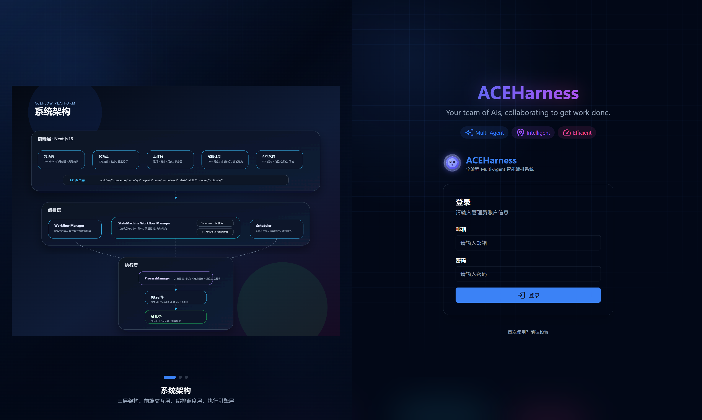
</div>

---

## 目录

- [快速开始](#快速开始)
- [核心亮点](#核心亮点)
- [系统架构](#系统架构)
- [功能模块](#功能模块)
- [工作流案例](#工作流案例)
- [配置与引擎](#配置与引擎)
- [技术栈](#技术栈)
- [贡献指南](#贡献指南)

---

## 快速开始

### 环境要求

- Node.js >= 18 / npm >= 9
- Claude Code CLI（执行引擎）、Kiro CLI 或 OpenCode

### 安装与运行

```bash
git clone <repository-url> && cd cangjie_frontend_ace

npm install

cp .env.example .env.local
# 编辑 .env.local，填入 API Key：
# ANTHROPIC_API_KEY=sk-ant-api03-你的密钥

npm run dev
# 访问 http://localhost:3000
# 自定义端口：npm run dev -- -p 8080
```

生产部署：`npm run build && npm start`（自定义端口：`npm start -- -p 8080`）

---

## 核心亮点

### 1. 对抗式迭代 -- Blue Team vs Red Team

每个工作流阶段可配置三种角色：

| 角色 | 职责 | 示例 Agent |
|------|------|-----------|
| **Defender** (蓝队) | 实现功能、编写代码 | architect, developer, fix-hunter, ... |
| **Attacker** (红队) | 审查质量、发现缺陷 | fix-breaker, design-breaker, stress-tester, ... |
| **Judge** (裁判) | 仲裁双方，输出判决 | fix-judge, code-judge, design-judge, ... |

Judge 输出结构化判决，系统据此自动决定"通过"或"继续迭代"：

```json
{ "verdict": "fail", "remaining_issues": 3, "summary": "边界条件未覆盖" }
```

内置 17 个专业 Agent，覆盖架构设计、代码实现、安全审计、性能测试等角色。部分 Agent 还配备了 Review Panel（会审模式），由多个子 Agent 从不同维度并行评审。

### 2. 自动化分析 -- 不只是跑任务，还能分析结果

系统不只是"按顺序调 Agent"，而是在执行过程中进行智能分析：

- **回归测试判定**：自动识别哪些测试需要跑（O0/O1/O2 不同优化级别），而不是盲目全量回归
- **回退路径分析**：流转图中实时展示回退次数、热点状态，帮助定位工作流瓶颈
- **成本追踪**：每个步骤记录 Token 用量和费用，支持成本优化决策
- **Prompt 分析**：对历史运行的 Prompt 进行质量评估和优化建议

### 3. 人工检查点 -- Human-in-the-Loop

在关键决策节点设置人工审批门：

- 方案设计完成后，人工确认是否开始编码
- 代码修复后，人工决定是否继续迭代或接受结果
- 支持**反馈注入**：在迭代过程中随时向 Agent 注入额外指令
- 支持**强制跳转**：不满意当前路径时，直接跳转到任意状态

### 4. 状态机工作流引擎 -- 不只是线性流水线

传统 AI 工作流只能"从头跑到尾"。ACEHarness 引入**有限状态机**模型，每个状态可以根据 Agent 输出的结构化判决（verdict）动态决定下一步走向：

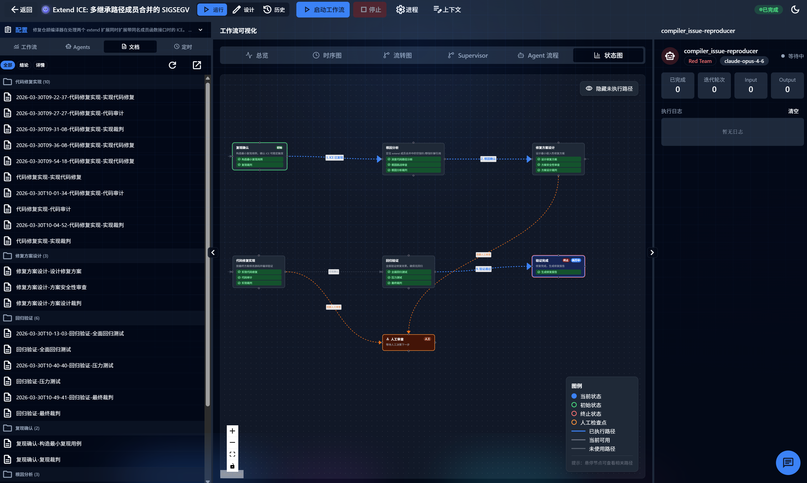

- **条件跳转**：Agent 输出 `{"verdict": "fail"}` 时自动回退到上游状态重新分析
- **最大转移次数保护**：防止死循环（如 `maxTransitions: 50`）
- **状态级上下文**：每个状态维护独立上下文，跨状态共享全局信息
- **崩溃恢复**：服务重启后自动检测中断的运行，支持断点续跑

在实际运行记录中可以看到，修复一个编译器 ICE 问题时工作流在"根因定位"和"方案设计"之间**自动回退了 3 次**，直到定位到真正的根因后才继续推进 -- 这就是状态机模式的价值。

### 5. 对话式创建工作流 -- 说一句话就能建

首页的对话界面不只是聊天，它内置 **70+ 种动作指令**，覆盖工作流全生命周期：

- "帮我创建一个修复 Issue #3116 的工作流" -- AI 会引导你选择模式、配置 Agent、设置迭代策略
- "把 fix-hunter 的模型换成 opus" -- 直接修改 Agent 配置
- "启动 oh-cangjiedev-sm 工作流" -- 一键启动
- "帮我提交一个 PR，标题是..." -- 集成 GitCode 操作

对话中的操作按风险等级分类：安全操作自动执行，变更操作需确认，破坏性操作需二次确认。

### 6. Supervisor 智能路由 -- 让 AI 决定找谁干活

**核心问题**：传统多 Agent 工作流中，Agent 按固定顺序执行、被动接收前序产出。信息不足时只能猜测，产出质量差再由人工 iterate -- 本质是 Agent「不知道自己不知道什么」，也「没有办法主动问别人」。

**架构设计**：ACEHarness 内置 Supervisor-Lite 架构，将协作拆成三层职责分离：

- **Agent** 只声明「我缺什么」（`[NEED_INFO]` 协议），不需要知道团队里有谁
- **Supervisor** 只做路由（关键词匹配 → 轻量 LLM → fallback 用户），不参与业务内容
- **WorkflowManager** 只管状态流转和持久化，不做路由决策

路由分两层：关键词命中则零成本直达，不命中才调轻量模型做语义匹配，再不行就降级给用户。整个过程嵌在一个 Plan 循环中（可配轮次上限），Agent 在信息充分后才正式执行。

**核心亮点**：

- **Agent 无感知**：prompt 中不注入 Agent 列表，Agent 只专注领域工作，路由完全交给 Supervisor
- **成本趋零**：大部分路由走关键词匹配，单次 LLM 路由约 $0.001，远低于信息不足导致的重跑成本
- **信息流打破线性**：分析员可以在执行中直接咨询编码实现者，不必等到对方的步骤执行完
- **渐进式零侵入**：步骤上加一行 `enablePlanLoop: true` 即启用，不加则执行路径完全不变；三级 fallback 保证流程永远不卡死

工作台中的 Supervisor 视图可以回放每一轮决策过程，清晰展示"为什么选了这条路"。

---

## 系统架构

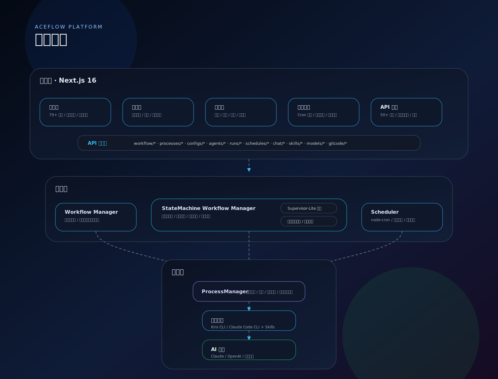

注：
- 实时通信使用 SSE 推送执行状态到前端
- 数据持久化采用 `runs/{runId}/` 目录存储状态、输出和流式内容

## 功能模块

### 对话页 (`/`)

主入口。与 AI 对话完成工作流全生命周期操作 -- 创建配置、管理 Agent、启动运行、查看结果、提交 PR，全部在对话中完成。

支持流式输出、会话持久化、模型切换、动作确认/撤销。内置向导流程引导用户分步创建工作流和 Agent。

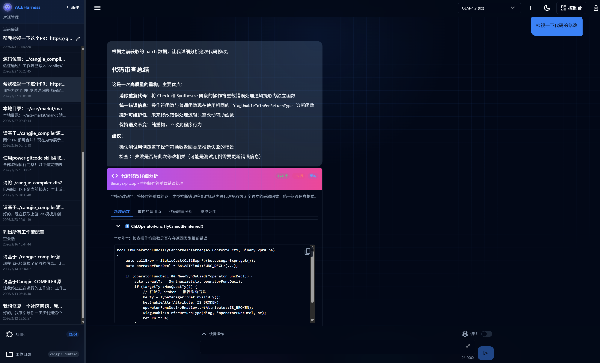

### 仪表盘 (`/dashboard`)

全局视图。展示运行总数、成功率、平均耗时、活跃工作流数等核心指标。提供 24 小时性能趋势图和 7 天活跃度图表，最近运行记录支持一键恢复。

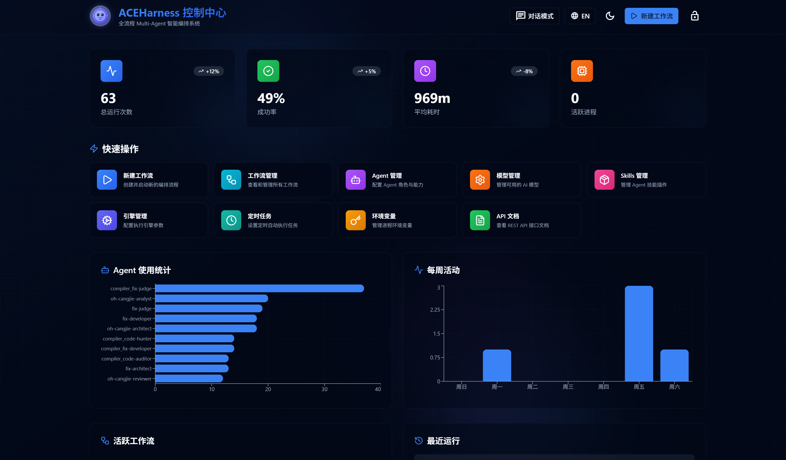

### 工作台 (`/workbench/[config]`)

核心工作区域，三种视图模式：

**运行视图** -- 启动工作流后的实时监控面板：
- 流程图实时高亮当前执行节点
- 步骤输出 Markdown 渲染，支持代码高亮
- 实时流面板：查看 Agent 正在输出的内容，随时注入反馈或中断
- 人工检查点弹窗：通过 / 继续迭代（附反馈）/ 拒绝
- 强制完成、强制跳转等应急操作

状态机模式额外提供 6 种可视化视图：
- **总览** -- 运行时统计面板 + 最近流转预览
- **时序图** -- 按时间线展示每次状态转移
- **流转图** -- 状态访问次数、回退路径、热点分析
- **Supervisor** -- 每轮决策的提问/路由记录
- **Agent 流程** -- Agent 间的消息传递和协作关系
- **状态图** -- ReactFlow 拓扑图，实时高亮执行路径

**设计视图** -- 可视化编辑工作流：
- 拖拽排序步骤、配置并行分组、设置迭代策略
- 实时生成 YAML 配置，Zod Schema 校验
- 支持跨阶段移动步骤

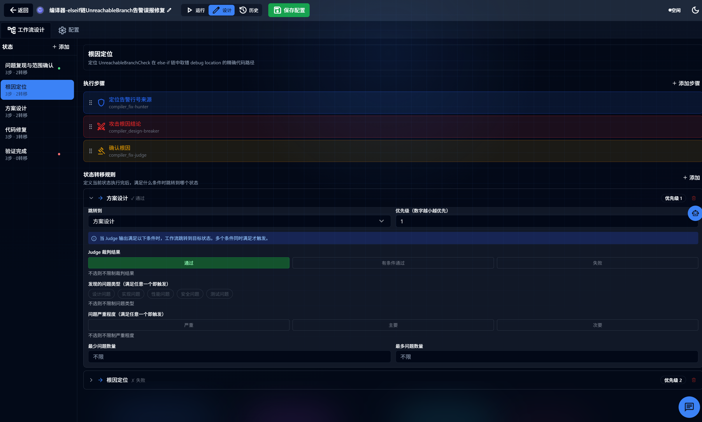

**历史视图** -- 运行记录管理：
- 按状态筛选、批量删除
- 查看每次运行的完整输出文件和文档
- Prompt 分析功能：评估历史 Prompt 质量

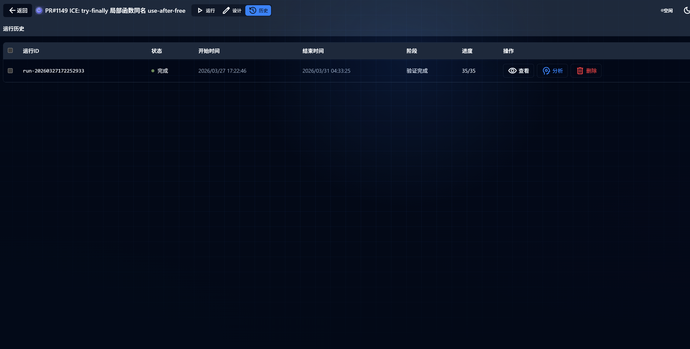

### 工作流管理 (`/workflows`)

配置文件的增删改查。卡片式布局展示所有工作流，支持搜索、复制、新建向导。

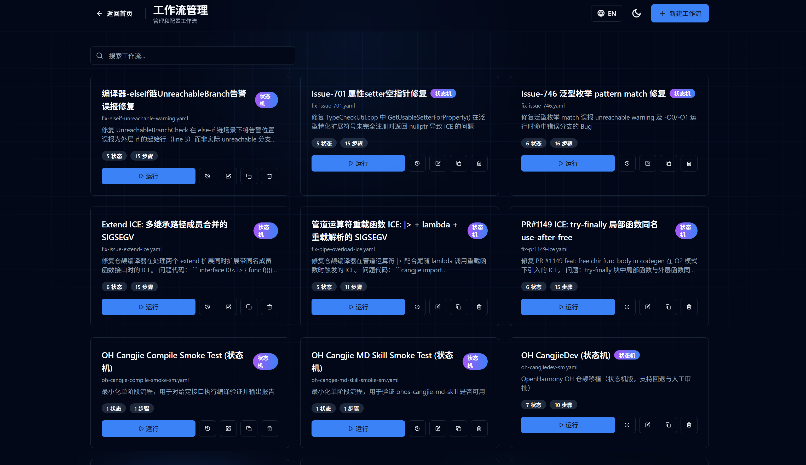

### 定时任务 (`/schedules`)

基于 Cron 表达式的定时调度。支持简单模式（每小时/每天/每周）和自定义 Cron 表达式，可手动触发测试。

### Skills 管理 (`/skills`)

双源 Skill 仓库：社区维护的 Cangjie Skills 和官方 Anthropics Skills。支持一键同步、标签过滤、详情查看。内置 10+ Skills 覆盖知识库检索、Excel 处理、Web 测试、MCP 构建、GitCode 操作、文档协作等场景。

### 模型管理 (`/models`)

拖拽排序配置 AI 模型列表，支持自定义显示名称、费率系数、API 端点。

### API 文档 (`/api-docs`)

内置交互式 API 文档，覆盖 50+ 端点，分为工作流控制、配置管理、运行记录、Agent、进程、定时任务、Chat、GitCode 等 10 个类别。

---

## 工作流案例

这一节按“总览 -> 代表性闭环 -> 结果型案例”组织，让读者先理解 ACEHarness 覆盖的场景，再下钻到关键工作流。这里改为静态 SVG 配图，首页展示效果更稳定，也更适合直接传达复杂流程。

> 建议阅读顺序：先看总览图，再看 Issue #3116 与 Issue #3112 的闭环流程，最后看性能优化和迁移场景。

### 图形化编排建议

| 案例 | 想突出什么 | 推荐图形 |
|------|-----------|---------|
| Issue #3116 | 状态机回退、人机协同、复杂问题收敛 | 带回退边和人工审批门的流程图 |
| Issue #3112 | 从分析到修复再到门禁的自动闭环 | 端到端流水线图 |
| AST 内存优化 | 对抗式评审驱动性能优化 | 结果卡片 + 前后对比图 |
| OpenHarmony 迁移 | 生产级迁移流程与回退机制 | 生产流程图 + 能力注入标注 |

### 案例总览图

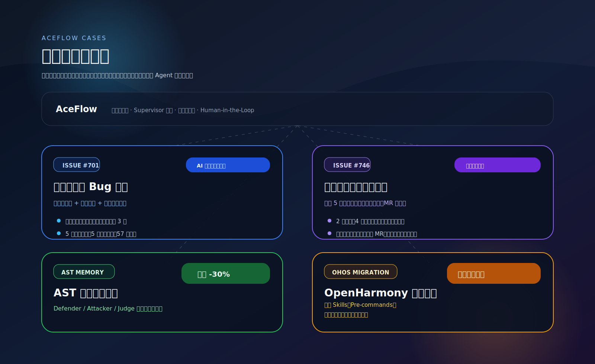

### 案例 1: Issue #3116 - 管道运算符重载 ICE: |> + lambda + 重载解析的 SIGSEGV

**场景**：仓颉编译器在管道运算符 `|>` 配合尾随 lambda 调用重载函数时触发 ICE（Internal Compiler Error），进程因 SIGSEGV（信号 11）崩溃，退出码 139。

**实际案例**：
- 社区问题：[Issue #3116](https://gitcode.com/Cangjie/UsersForum/issues/3116)
- 修复 PR：[cangjie_compiler#1405](https://gitcode.com/Cangjie/cangjie_compiler/pull/1405) ✅ 已合入
- 测试 PR：[cangjie_test#1387](https://gitcode.com/Cangjie/cangjie_test/pull/1387) ✅ 已合入

**触发代码**：
```cangjie
import std.collection.map
func test(input: Array<Float64>) { input |> map { p => f(p + 1.0) } }
func f(float: Float64) { float }
func f(int: Int64) { int }
main() { 0 }
```

**工作流结构**（状态机模式，5 个状态，最多 30 次状态转移）：

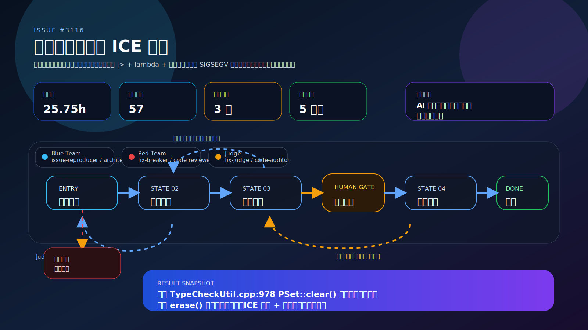

#### 核心设计 1：四条件触发分析与最小复现

工作流首先通过变体测试确定触发 ICE 的充分必要条件，四个条件必须同时满足：
- **管道运算符 `|>`**：将表达式作为第一参数传递给右侧函数
- **尾随 lambda**：`{ p => ... }` 作为管道目标函数的额外参数
- **重载函数调用**：lambda 体内调用存在多个重载的函数 `f`
- **无类型标注的 lambda 参数**：`p` 未标注类型，需要编译器推导

对照用例：显式标注 lambda 参数类型时不崩溃（给出语义错误）：
```cangjie
func test(input: Array<Float64>) { input |> map { p: Float64 => f(p + 1.0) }}
```

#### 核心设计 2：精确定位崩溃代码路径

通过红蓝对抗式根因分析，精确定位崩溃路径：
```
TypeCheckLambda
  → TryEnforceCandidate (TypeCheckUtil.cpp:978)
    → PSet::clear()  ← 根因：销毁 log/stashes 检查点层，深度重置为 1
  → CommitScope 析构
    → PSet::apply()
      → stashes.back() 越界访问  ← SIGSEGV
```

**根因**：`TypeCheckUtil.cpp` 第 978 行，`TryEnforceCandidate` 函数中调用 `tyMgr.constraints[&tv].sum.clear()`。`PSet<T>::clear()` 是破坏性操作——它调用 `log.clear()` 和 `stashes.clear()`，将检查点深度重置为 1。然而同一约束（Bound）中的其他 PSet 成员（lbs、ubs、eq）仍保持原始深度（3+）。当 `CommitScope` 析构函数遍历所有约束并调用 `apply()` 时，深度为 1 的 sum 尝试访问 `stashes.back()`，但 stashes 已被清空或大小不匹配，导致越界访问 → SIGSEGV。

#### 核心设计 3：最小侵入性修复 — 保持检查点深度不变量

修复方案将破坏性的 `clear()` 改为逐个 `erase()` 循环：

```diff
-        tyMgr.constraints[&tv].sum.clear();
+        auto& sum = tyMgr.constraints[&tv].sum;
+        while (!sum.raw().empty()) {
+            sum.erase(sum.raw().begin());
+        }
```

**修复原理**：
- `clear()`：销毁 log/stashes，重置深度为 1 ❌
- `erase()` 循环：每次 erase 通过 `checkOut()` 记录到当前检查点，保持深度一致 ✅

语义上等价于 `clear()`（清空集合后由 `AddSumByCtor` 重新填充），但保留了检查点深度不变量。

#### 核心设计 4：全面验证 — ICE 消除 + 功能回归 + LLT 测试

**ICE 消除验证**：
- 原始复现（pipe + lambda + overload）：exit 139 → exit 1（语义错误）✅
- 最小复现 V17（无 pipe）：exit 139 → exit 1（语义错误）✅
- 三重载变体：exit 139 → exit 1（语义错误）✅

修复后编译器给出明确语义错误："parameters of this lambda expression must have type annotations"，而非崩溃。

**功能回归验证**：
- 管道运算符基本功能（`5 |> double`）：✅ 正常工作
- 函数重载解析（`f(1.0)` / `f(1)`）：✅ 正确解析
- 管道 + 无重载 lambda：✅ 正常工作
- 显式类型标注 lambda：✅ 正常工作

**LLT 测试套件**：240/240 通过
- 新增 ICE 测试（sema_lambda_overload_ice）：8/8 ✅
- 现有 overload 测试：15/15 ✅
- 现有 sema_test 诊断测试：35/35 ✅
- 现有 flow_expr 管道测试：23/23 ✅
- 现有 lambda 测试：74/74 ✅
- 现有 call 测试：85/85 ✅

**新增 8 个 LLT 测试用例**（`cangjie_test/testsuites/LLT/compiler/Diagnose/sema_test/sema_lambda_overload_ice/`）：
- case1.cj：原始复现（pipe + trailing lambda + 双重载）
- case2.cj：无 pipe（直接 lambda 赋值 + 双重载）
- case3.cj：三重载函数
- case4.cj：嵌套 lambda + 重载
- case5.cj：多参数 lambda + 重载
- case6.cj：链式管道 + 重载
- case7.cj：多重载 + 类型转换组合
- case8.cj：压力测试（深层嵌套 + 多重载）

#### 核心设计 5：根因分析的多轮迭代与条件性通过

工作流在根因分析阶段经历了 **6 次访问**（包含 2 次条件性通过），通过多轮迭代逐步收敛到精确的崩溃路径和根因。这体现了状态机工作流的自动回退与迭代能力，确保根因分析的准确性。

#### 执行数据

实际执行数据：

- 总耗时 **约 7.5 小时**，完成 **6 次状态转移** / 30 次上限
- **状态访问统计**：根因分析 6 次（含 2 次条件性通过）、修复实现 2 次、验证测试 2 次
- **代码改动**：-1/+3 行（`src/Sema/TypeCheckUtil.cpp`）
- **根因**：`TypeCheckUtil.cpp:978` 的 `PSet::clear()` 破坏检查点深度不变量
- **修复方案**：改用 `erase()` 循环保持检查点深度一致
- **验证结果**：
  - ICE 消除验证：3/3 通过（原始、最小、三重载）
  - 功能回归验证：4/4 通过（管道、重载、lambda、类型标注）
  - LLT 测试套件：240/240 PASS
  - 新增测试用例：8 个
  - 压力测试：4/4 通过（零崩溃）
- **状态**：✅ 已合入主分支

PR：https://gitcode.com/Cangjie/cangjie_compiler/pull/1405

### 案例 2: Issue #3112 - Extend ICE: 多继承路径成员合并的 SIGSEGV

**场景**：仓颉编译器在处理两个 extend 扩展同时扩展带同名成员函数接口时触发 ICE (Internal Compiler Error)，Windows 环境下错误码 11 (SIGSEGV)。

**实际案例**：
- 问题报告：[Issue #3112](https://gitcode.com/Cangjie/UsersForum/issues/3112)
- 修复 PR：[cangjie_compiler#1371](https://gitcode.com/Cangjie/cangjie_compiler/pull/1371) ✅ 已合入
- 测试 PR：[cangjie_test#1341](https://gitcode.com/Cangjie/cangjie_test/pull/1341) ✅ 已合入

**工作流结构**（状态机模式，7 个状态，最多 30 次状态转移）：

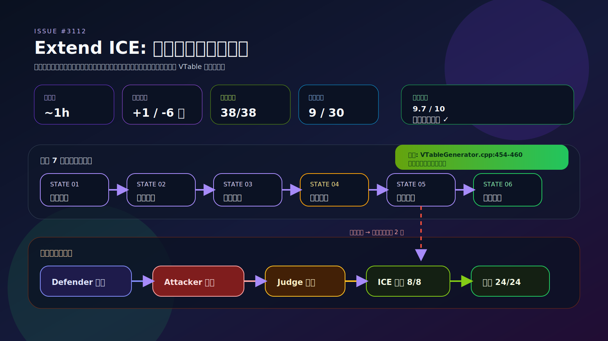

#### 核心设计 1：最小复现用例构造与触发条件确认

工作流首先构造最小可复现用例，通过变体测试确定触发 ICE 的充分必要条件：
- 两个 extend 扩展同一个类 `C<A>`
- 被扩展的接口存在继承关系（`I1<T> <: I0<T>`），且父接口 `I0` 含默认实现的成员函数 `f`
- 类型参数为复合泛型类型（如 `Option<A>`），而非直接的泛型参数 `A`

#### 核心设计 2：红蓝对抗式根因分析

- **Defender (code-hunter)**：深度分析 VTable 构建路径，定位到 `VTableGenerator.cpp:454-460` 的 step 3 缺陷
- **Attacker (code-auditor)**：独立验证根因假设，挑战是否存在其他 ICE 路径
- **Judge (fix-judge)**：综合双方分析，确认根因为 VTable 构建 step 3 缺少复合泛型类型的递归替换

#### 核心设计 3：最小侵入性修复方案

在根因明确后，改动控制在 **+1/-6 行**（`src/CHIR/GenerateVTable/VTableGenerator.cpp`）：
- 改用 `ReplaceRawGenericArgType` 递归替换，覆盖复合类型场景
- 使用项目中已有的成熟工具函数（86+ 处调用），是原逻辑的严格超集

#### 核心设计 4：多维度验证确保修复质量

- **ICE 消除验证**：8/8 通过（原始用例、反转顺序、嵌套泛型、多泛型参数等）
- **LLT 测试**：新增 `testExtend52.cj`，精确复现原始 ICE 场景
- **回归测试**：38/38 PASS（Extend/Generic/Class/Closure 等 6 套件）
- **压力测试**：24/24 通过（多泛型参数、深度嵌套、长继承链、混合继承等）

#### 核心设计 5：人工审查与回退机制

工作流在关键节点设置人工审批门，支持回退和反馈注入：
- 方案设计后人工确认是否进入代码修复
- 代码修复后人工决定是否继续迭代或接受结果
- 实际执行中**回退 2 次**（代码修复实现 → 人工审查），确保修复质量

#### 执行数据

实际执行数据（run-20260402）：

- 总耗时 **约 1 小时**，完成 **9 次状态转移** / 30 次上限
- **回退次数**：2 次（代码修复实现 → 人工审查）
- **状态访问统计**：人工审查 6 次（3 次人工决策）、代码修复 4 次、根因分析 2 次
- **代码改动**：+1/-6 行（`VTableGenerator.cpp`）
- **根因**：VTable 构建 step 3 缺少复合泛型类型的递归替换
- **修复方案**：改用 `ReplaceRawGenericArgType` 递归替换
- **验证结果**：
  - ICE 消除验证：8/8 通过
  - LLT 测试：新增 testExtend52.cj
  - 回归测试：38/38 PASS
  - 压力测试：24/24 通过
- **综合评分**：9.7/10
- **状态**：✅ 已合入主分支

PR：https://gitcode.com/Cangjie/cangjie_compiler/pull/1371

### 案例 3: AST 析构内存优化 -- 30% 内存峰值下降

**场景**：仓颉编译器在 AST 阶段结束后未及时释放内存，导致编译大型项目时内存峰值过高。

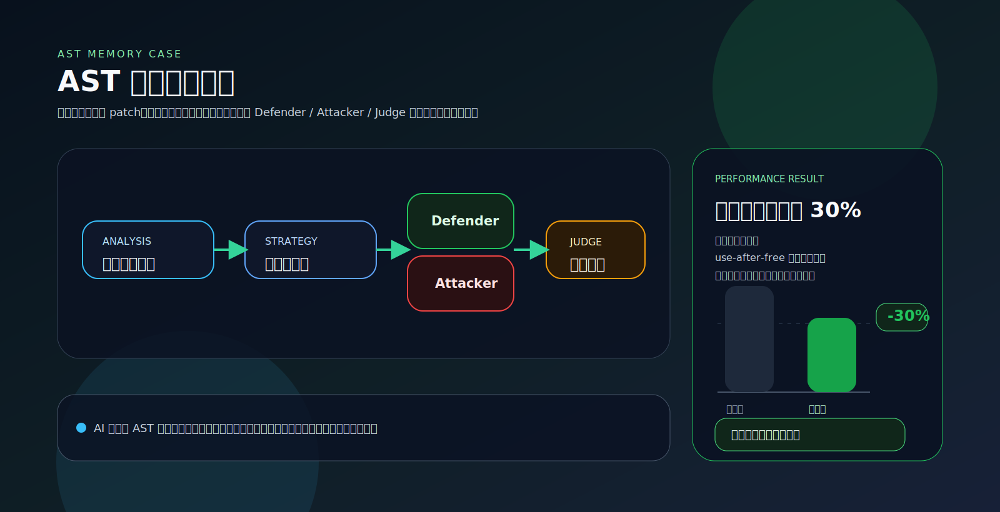

通过 Defender/Attacker/Judge 三角色多轮迭代，AI 分析了 AST 节点的生命周期，设计了分阶段释放策略。经过对抗式审查确认方案不会引入 use-after-free 等内存安全问题后，实施优化并验证。**最终实现编译期内存峰值下降约 30%**。

**工作流结构**（对抗式迭代，多轮 Defender / Attacker / Judge）：

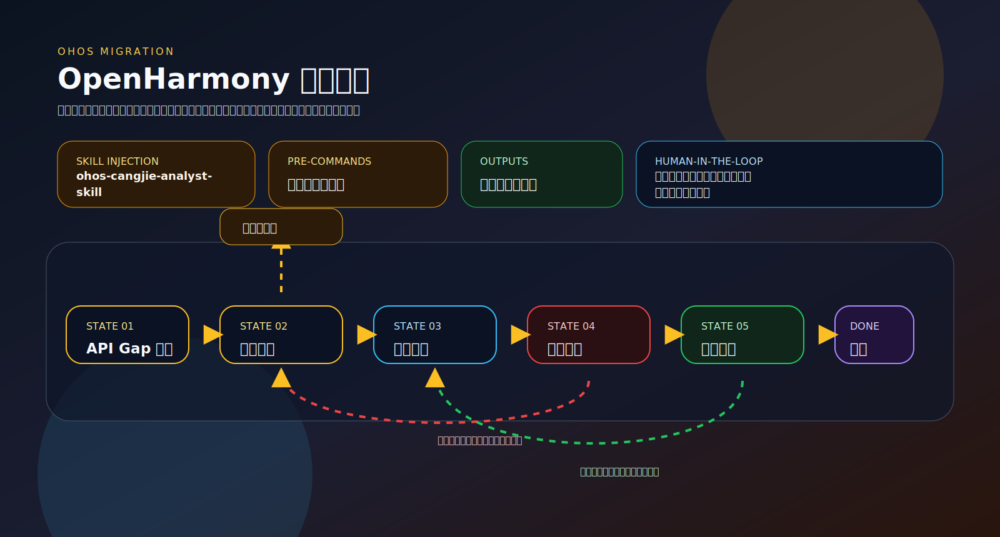

#### 核心设计 1：基于 AST 生命周期的分阶段释放

AI 先梳理 AST 节点所有权与可见期，再设计「阶段结束后可安全释放」的粒度与时机，使优化目标（降峰值）与语义正确性约束对齐，而不是简单提前 `free`。

#### 核心设计 2：对抗式审查优先排除内存类缺陷

Attacker 侧重挑战「提前释放、双重释放、UAF」等路径；Judge 对是否可进入实现/合并给出结构化结论。通过多轮迭代，在动内存前尽量消化高风险质疑。

#### 核心设计 3：量化结果与人工基线对比

- **AI 辅助方案**：编译期内存峰值约 **下降 30%**
- **同一方向人工实现**：峰值约 **下降 70%**

差距说明当前 AI 在「更激进仍安全」的优化上仍有边界，适合作为**人工主导、AI 辅助**的参考案例，而非完全自主上限。

#### 执行数据

实际复盘（无独立 run 编号）：

- 优化类型：AST 阶段后内存释放与峰值控制
- 峰值收益（AI 方案）：约 **30%** 下降（相对优化前基线）
- 对照：人工实现约 **70%** 峰值下降，AI 方案更保守
- 风险管控：依赖红军挑战与**充分人工审查**；后续可结合知识库与提示词迭代缩小与人方案差距

### 案例 4: 仓颉鸿蒙 SDK API 开发 -- 从 Gap 分析到 API 文档的全流程自动化

**场景**：基于 OpenHarmony `@ohos.file.fs` 文件系统模块，开发对应的仓颉鸿蒙 SDK API。需求为：分析该模块全部 ArkTS API，按优先级排序后选取 3 个方法完成仓颉接口开发。

这个案例的核心价值在于：**AI 不只是写代码，而是完成了从需求澄清、Gap 分析、架构设计、跨语言编码、对抗式审查到标准 API 文档生成的完整软件工程闭环**。

**工作流结构**（状态机模式，7 个状态，6 个 Agent，最多 50 次状态转移）：

```
分析Gap → 架构设计 → 实现编码 → 红军审查 → 最终验证 → 生成API文档 → 完成
                       ↑  ↑        │          │
                       │  └─回退───┘          │
                       └──────── 回退 ────────┘
```

#### 核心设计 1：AI 主动澄清需求，从源头避免返工

传统 AI 工具拿到需求就直接开始写代码。这个工作流中，Analyst Agent 在执行前**主动向用户确认关键决策**，而不是基于猜测开始工作：

- **优先级规则** -- Agent 主动提供 5 种候选策略（依赖优先 / 使用频率 / 复杂度递增 / 复杂度递减 / 自定义），引导用户做出明确选择
- **接口范围** -- 确认仅做同步方法还是同时包含异步，避免分析范围与用户预期偏离

用户确认后，后续 6 个步骤的执行方向从源头就是对的。这比「先猜后改」的模式节省了大量迭代成本。

#### 核心设计 2：三层跨语言 API 开发，AI 自主管理层间一致性

仓颉鸿蒙 SDK 的 API 开发不是单语言编码，而是需要**同时维护三层实现的一致性**：

| 层 | 语言 | 职责 |
|----|------|------|
| CJ SDK 声明层 | 仓颉 | 对外暴露的 API 签名（`file_fs.cj`） |
| CJ Wrapper 层 | 仓颉 | FFI 桥接函数声明（`file_ffi.cj`） |
| C++ FFI 层 | C++ | NAPI 调用封装 + FFI 导出（`file_impl.cpp` / `file_ffi.cpp`） |

AI 在这个流程中自主完成了三层代码的一致性开发：Gap 分析定位每一层的缺失状态，架构设计确定层间接口和结构体复用策略，编码实现同时修改 6 个文件（C++ 4 个 + 仓颉 2 个），编译验证确认跨语言链接正确（`llvm-nm -D` 验证 FFI 符号导出）。

#### 核心设计 3：红军按 NAPI 源码逐项交叉验证

红军审查不是泛泛的代码审查，而是**拿着 ArkTS NAPI 的源码逐个方法做行为对齐验证**。例如：

- 发现 `getxattr` 的错误处理语义差异：NAPI 对 `xAttrSize <= 0` 统一返回空串，CJ FFI 仅处理 `ENODATA`
- 发现 `lstat` 缺少 `file://` URI 解析：NAPI 有 `ParsePath()` 处理 URI scheme
- 发现 `BUILD.gn` 构建配置的条件反转和依赖缺失

这些不是语法错误或风格问题，而是**跨语言 API 开发场景下的语义级缺陷** -- 只有深度理解两套代码的行为才能发现。

#### 核心设计 4：真实编译验证，不是模拟

编译验证步骤配置了 `preCommands`，在真实的 OpenHarmony 构建环境中执行 `build.sh`。构建产物 `libcj_file_fs_ffi.z.so` 实际生成，`llvm-nm -D` 确认 26 个 FFI 符号全部以 `T`（全局可见）正确导出。

#### 核心设计 5：API 文档自动生成，闭环交付

流程的最后一步不是代码提交，而是通过 `cjcom gen --gen=md-sys` 自动生成标准格式的仓颉 API 文档（1961 行，32170 bytes），覆盖模块全部 func / class / struct / enum。开发者拿到的不只是代码，而是可以直接发布的 API 文档。

#### 执行数据

实际执行数据（run-20260323172056345）：

- 总耗时 **2 小时 5 分钟**，完成 **11 个步骤**，**10 次状态转移**
- 3 个 API 完成全栈开发（`lstatSync`、`mkdtempSync`、`getxattrSync`），C++ FFI 编译通过
- 注入 5 套专属 Skills，每个 Agent 携带仓颉/鸿蒙领域知识
- 产出 **11 份结构化文档**，涵盖 Gap 分析、架构设计、编码实现、编译验证、红军审查、评审裁决、最终审查、API 文档、产出汇总
- 全部产出写入 `.ace-outputs/{runId}/` 目录，全链路可追溯

---

## 配置与引擎

### 环境变量 (`.env.local`)

| 变量 | 说明 | 必填 |
|------|------|------|
| `ANTHROPIC_API_KEY` | Anthropic API 密钥 | 是 |
| `ANTHROPIC_BASE_URL` | 自定义 API 地址（代理/自建网关） | 否 |
| `OPENAI_API_KEY` | OpenAI API 密钥 | 否 |
| `OPENAI_BASE_URL` | OpenAI 兼容 API 地址 | 否 |
| `NEXT_PUBLIC_API_BASE` | 前后端分离时的后端地址 | 否 |

### 执行引擎 (`.engine.json`)

```json
{ "engine": "claude-code" }
```

支持三种引擎：

| 引擎 | 说明 |
|------|------|
| `claude-code` | 推荐，Claude Code CLI |
| `kiro-cli` | Kiro CLI |
| `opencode` | OpenCode（ACP 协议） |

子进程会继承 `process.env`，无需额外配置。切换引擎只需修改 `.engine.json` 中的 `engine` 字段。

---

## 技术栈

| 类别 | 技术 |
|------|------|
| 框架 | Next.js 16, React 18, TypeScript 5 |
| UI | Tailwind CSS 3, Shadcn/ui, Radix UI, Framer Motion |
| 可视化 | ReactFlow 11, Recharts 3 |
| 表单 | React Hook Form 7, Zod 3 |
| 拖拽 | @dnd-kit |
| Markdown | react-markdown, remark-gfm, react-syntax-highlighter |
| 国际化 | next-intl (中/英), next-themes (深色/浅色) |
| 调度 | node-cron |
| 配置 | YAML |

---

## 贡献指南

```bash
# Fork → 创建分支 → 提交 → PR
git checkout -b feature/your-feature
git commit -m "feat: add new feature"
git push origin feature/your-feature
```

Commit 规范遵循 [Conventional Commits](https://www.conventionalcommits.org/)：`feat` / `fix` / `docs` / `perf` / `refactor` / `test` / `chore`

---

## 许可证

MIT License
