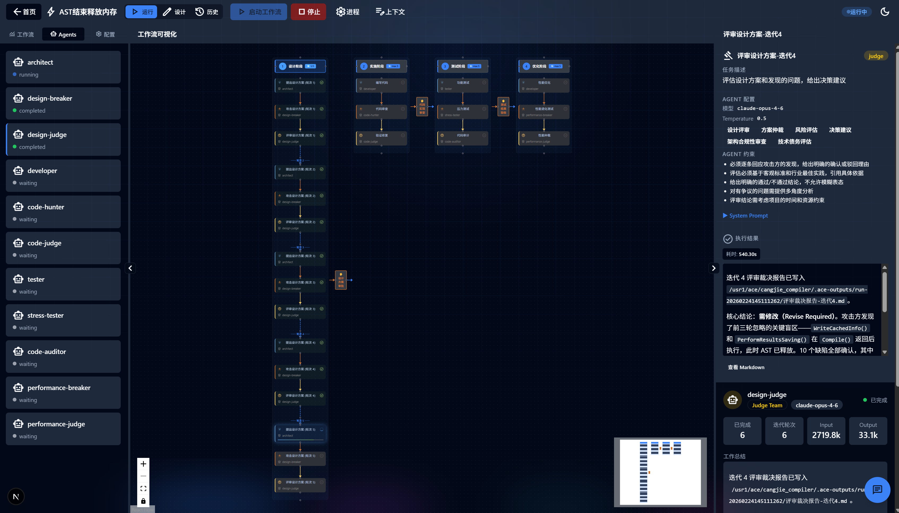
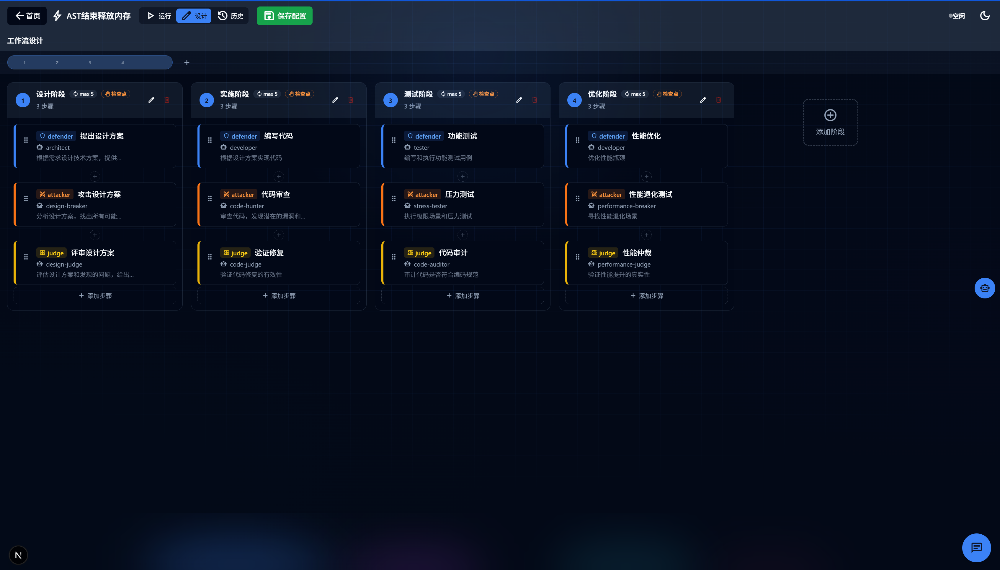
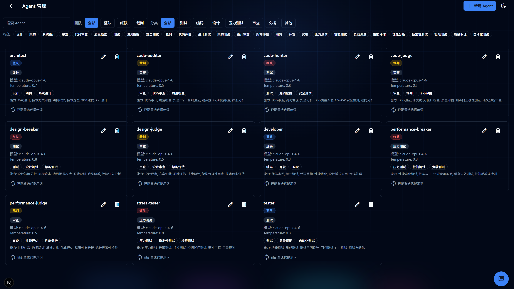

# AI Orchestrator (AceFlow)

多 AI 协同工作调度系统 - 支持对抗式迭代工作流的 Next.js + React 实现

## 截图展示

### 工作流运行视图

实时监控工作流执行状态，查看每个步骤的进度和输出结果

### 工作流设计视图

可视化编辑工作流，支持拖拽排序、并行分组、迭代配置等

### Agent 管理

管理和配置 AI Agent，设置模型、能力、约束条件等

## 技术栈

- **Next.js 16** - React 框架，支持 App Router 和 API Routes
- **React 18** - UI 库
- **TypeScript 5** - 类型安全
- **ReactFlow 11** - 专业流程图可视化
- **Tailwind CSS 3** - 实用优先的 CSS 框架
- **Shadcn/ui** - 基于 Radix UI 的高质量 React 组件库
- **Zod 3** - Schema 验证
- **React Hook Form 7** - 表单管理和验证
- **YAML** - 配置文件格式
- **Framer Motion 12** - 动画库
- **next-intl** - 国际化支持
- **next-themes** - 主题切换

## 功能特性

### 核心功能
- ✅ 工作流可视化展示（使用 ReactFlow）
- ✅ 实时 Agent 状态监控
- ✅ 执行日志查看
- ✅ 人工检查点审批
- ✅ 配置文件管理（YAML）
- ✅ Server-Sent Events 实时更新
- ✅ 历史运行记录查看和恢复
- ✅ 多语言支持（中文/英文）
- ✅ 深色/浅色主题切换

### 对抗式迭代工作流
- ✅ 三角色协作模式（Defender/Attacker/Judge）
- ✅ 自动迭代执行（最多 N 轮）
- ✅ 结构化判决输出（pass/conditional_pass/fail）
- ✅ 人工评审意见注入
  - 每轮迭代结束后支持人工输入评审意见
  - 评审意见作为下一轮迭代的检查项
  - 支持"通过"或"继续迭代"两种决策
- ✅ 迭代状态持久化和恢复
- ✅ 多种退出条件（连续无问题轮次、全部解决、手动）
- ✅ 人工升级机制

### 进程管理
- ✅ Claude CLI 进程调度
- ✅ 并发控制（最多 3 个并发）
- ✅ 进程队列管理
- ✅ 进程终止和清理
- ✅ 实时进程状态监控
- ✅ 流式输出捕获和展示
- ✅ 强制完成功能

### 配置管理
- ✅ 可视化配置编辑器
- ✅ 新建配置向导
- ✅ 表单验证（Zod Schema）
- ✅ YAML 自动生成
- ✅ 配置文件保存和加载
- ✅ 配置复制和删除
- ✅ Agent 配置独立管理

### 工作流设计
- ✅ 可视化流程图编辑
- ✅ 拖拽式步骤排序
- ✅ 并行步骤分组
- ✅ 跨阶段步骤移动
- ✅ 迭代配置（最大轮次、退出条件等）
- ✅ 检查点配置

### 运行管理
- ✅ 运行记录持久化
- ✅ 崩溃恢复（服务重启后自动检测）
- ✅ 断点续跑（从失败步骤恢复）
- ✅ 步骤输出查看（支持 Markdown 渲染）
- ✅ 成本和耗时统计
- ✅ Token 使用量追踪

## 开发

```bash
# 安装依赖
npm install

# 启动开发服务器
npm run dev
```

访问 http://localhost:3000

## 配置 API Key

对话与工作流执行依赖 Anthropic（Claude）API，请按以下方式配置：

1. **复制环境变量示例并填写 Key**
   ```bash
   cp .env.example .env.local
   ```
   编辑 `.env.local`，填入你的 API Key：
   ```
   ANTHROPIC_API_KEY=sk-ant-api03-你的密钥
   ```
   - 获取 Key： [Anthropic Console](https://console.anthropic.com/)
   - `.env.local` 已被 git 忽略，不会提交到仓库

2. **重启开发服务器**  
   修改 `.env.local` 后需重启 `npm run dev` 才能生效。

3. **若使用 Claude CLI 或 Kiro CLI**  
   子进程会继承当前环境变量，因此上述配置对「对话页」和「工作流执行」均生效。若在系统里已配置 `ANTHROPIC_API_KEY`（如 `~/.bashrc`），也可不建 `.env.local`，只要启动 `npm run dev` 时该变量已存在即可。

（若使用 OpenAI 模型，可在 `.env.local` 中增加 `OPENAI_API_KEY=...`。）

### 配置项一览

所有可配置项如下（详见 `.env.example`）：

| 配置项 | 说明 | 示例 |
|--------|------|------|
| **环境变量（.env.local）** | | |
| `ANTHROPIC_API_KEY` | Anthropic API 密钥（必填） | `sk-ant-api03-...` |
| `ANTHROPIC_BASE_URL` | Claude API 自定义地址（代理/自建） | `https://your-gateway.com/v1` |
| `ANTHROPIC_TIMEOUT` | 请求超时（毫秒，可选） | `120000` |
| `OPENAI_API_KEY` | OpenAI API 密钥（使用 OpenAI 模型时） | `sk-...` |
| `OPENAI_BASE_URL` | OpenAI 兼容 API 自定义地址 | `https://your-proxy.com/v1` |
| `NEXT_PUBLIC_API_BASE` | 前端请求的后端 API 根路径（前后端分离时） | `https://api.example.com` |
| **项目内文件** | | |
| `.engine.json` | 执行引擎选择 | `{"engine": "kiro-cli"}` 或 `"claude-code"` |
| 工作流 YAML `context.timeoutMinutes` | 单步超时（分钟） | `30` |

- **API URL**：通过 `ANTHROPIC_BASE_URL` / `OPENAI_BASE_URL` 可走代理或自建网关；子进程会继承 `process.env`，写在 `.env.local` 即可。
- **前端 API 地址**：默认同源 `/api`；前后端分离时设置 `NEXT_PUBLIC_API_BASE` 为后端根地址，并重启 `npm run dev`。

## 构建

```bash
npm run build
npm start
```

## 项目结构

```
src/
├── app/                           # Next.js App Router
│   ├── api/                      # API Routes
│   │   ├── agents/               # Agent 配置管理
│   │   ├── configs/              # 工作流配置管理
│   │   ├── workflow/             # 工作流控制
│   │   │   ├── start/route.ts
│   │   │   ├── stop/route.ts
│   │   │   ├── resume/route.ts
│   │   │   ├── approve/route.ts
│   │   │   ├── iterate/route.ts  # 迭代控制（支持反馈）
│   │   │   ├── force-complete/route.ts
│   │   │   ├── status/route.ts
│   │   │   └── events/route.ts   # SSE
│   │   ├── processes/            # 进程管理
│   │   └── runs/                 # 运行记录管理
│   ├── workbench/[config]/       # 工作台页面
│   ├── workflows/                # 工作流列表页
│   ├── agents/                   # Agent 管理页
│   ├── layout.tsx
│   ├── page.tsx
│   └── globals.css
├── components/                    # React 组件
│   ├── ui/                       # Shadcn/ui 组件
│   ├── FlowDiagram.tsx           # 运行视图流程图
│   ├── DesignFlowDiagram.tsx     # 设计视图流程图
│   ├── AgentPanel.tsx
│   ├── ProcessPanel.tsx
│   ├── EditNodeModal.tsx         # 节点编辑模态框
│   ├── Markdown.tsx              # Markdown 渲染器
│   └── ResizablePanels.tsx       # 可调整大小的面板
├── hooks/                        # React Hooks
│   ├── useWorkflowState.ts       # 工作流状态管理
│   ├── useConfirmDialog.ts       # 确认对话框
│   └── useTranslations.ts        # 国际化
├── lib/                          # 工具库
│   ├── api.ts                    # API 客户端
│   ├── schemas.ts                # Zod Schema 定义
│   ├── process-manager.ts        # 进程管理器
│   ├── workflow-manager.ts       # 工作流管理器
│   ├── run-store.ts              # 运行记录存储
│   └── run-state-persistence.ts  # 状态持久化
└── contexts/                     # React Context
    └── ChatContext.tsx

configs/                          # 工作流配置文件
├── workflow.yaml
└── agents/                       # Agent 配置目录
    ├── architect.yaml
    ├── developer.yaml
    └── ...

runs/                             # 运行记录目录
└── run-YYYYMMDD-HHMMSS/
    ├── state.json                # 运行状态
    ├── outputs/                  # 步骤输出
    └── streams/                  # 流式输出
```

## API 端点

### 配置管理
- `GET /api/configs` - 获取配置文件列表
- `GET /api/configs/:filename` - 读取配置文件
- `POST /api/configs/:filename` - 保存配置文件
- `POST /api/configs/:filename/copy` - 复制配置文件
- `DELETE /api/configs/:filename` - 删除配置文件

### Agent 管理
- `GET /api/agents` - 获取 Agent 列表
- `GET /api/agents/:name` - 读取 Agent 配置
- `POST /api/agents/:name` - 保存 Agent 配置
- `DELETE /api/agents/:name` - 删除 Agent

### 工作流控制
- `POST /api/workflow/start` - 启动工作流
- `POST /api/workflow/stop` - 停止工作流
- `POST /api/workflow/resume` - 恢复运行（支持 action 和 feedback 参数）
- `POST /api/workflow/approve` - 批准检查点
- `POST /api/workflow/iterate` - 请求继续迭代（需要 feedback 参数）
- `POST /api/workflow/force-complete` - 强制完成当前步骤
- `GET /api/workflow/status` - 获取工作流状态
- `GET /api/workflow/events` - SSE 事件流

### 运行记录
- `GET /api/runs/by-config/:configFile` - 获取指定配置的运行记录
- `GET /api/runs/:id/detail` - 获取运行详情
- `GET /api/runs/:id/outputs` - 获取步骤输出列表
- `GET /api/runs/:id/outputs?step=:stepName` - 获取指定步骤输出
- `GET /api/runs/:id/stream?step=:stepName` - 获取流式输出

### 进程管理
- `GET /api/processes` - 获取所有进程和统计信息
- `GET /api/processes/:id` - 获取指定进程详情

## 配置文件格式

### 工作流配置 (workflow.yaml)

```yaml
workflow:
  name: "工作流名称"
  description: "工作流描述"
  phases:
    - name: "设计阶段"
      iteration:                    # 迭代配置（可选）
        enabled: true               # 是否启用迭代
        maxIterations: 5            # 最大迭代轮次（1-20）
        exitCondition: all_resolved # 退出条件：no_new_bugs_3_rounds | all_resolved | manual
        consecutiveCleanRounds: 3   # 连续无问题轮次数（1-10）
        escalateToHuman: true       # 达到最大轮次时是否升级人工
      steps:
        - name: "提出设计方案"
          agent: "architect"
          task: "根据需求设计技术方案"
          role: defender            # 角色：defender | attacker | judge
          type: adversarial         # 步骤类型（可选）
          constraints:              # 约束条件（可选）
            - "必须提供多个备选方案"
          parallelGroup: "group-1"  # 并行组ID（可选，相同ID的步骤并行执行）
          enableReviewPanel: false  # 是否启用会审模式（可选）
        - name: "攻击设计方案"
          agent: "design-breaker"
          task: "分析设计方案，找出缺陷"
          role: attacker
        - name: "评审设计方案"
          agent: "design-judge"
          task: "评估设计方案和问题"
          role: judge
      checkpoint:                   # 检查点（可选）
        name: "设计方案审批"
        message: "请审查设计方案"

context:
  projectRoot: "/path/to/project"   # 项目根目录
  requirements: "需求描述"           # 需求说明
  codebase: "/path/to/src"          # 代码库路径（可选）
  timeoutMinutes: 30                # 步骤超时时间（分钟）

judgeConfig:                        # 裁判配置（可选）
  regressionThreshold: 0.1          # 性能退化阈值
```

### Agent 配置 (agents/*.yaml)

```yaml
name: "architect"                   # Agent 名称（必填）
team: "blue"                        # 团队：blue | red | judge
category: "设计"                    # 分类（可选）
tags:                               # 标签（可选）
  - "设计"
  - "架构"
model: "claude-opus-4-6"            # 模型名称
temperature: 0.7                    # 温度参数（可选，0-1）

allowedTools:                       # 允许使用的工具（可选）
  - "Bash"
  - "Read"
  - "Write"
  - "Edit"
  - "Glob"
  - "Grep"

capabilities:                       # 能力列表（必填）
  - "系统设计"
  - "架构评审"

systemPrompt: |                     # 系统提示（必填）
  你是一个资深架构师...
  
  核心职责：
  - 深入分析需求
  - 提供备选方案
  
  设计原则：
  - 职责清晰分离
  - 优先成熟模式

iterationPrompt: |                  # 迭代提示（可选，用于迭代轮次）
  你现在处于迭代优化阶段...
  
  迭代原则：
  - 优先局部优化
  - 保持接口稳定

constraints:                        # 约束条件（可选）
  - "必须提供至少两个备选方案"
  - "需考虑向后兼容性"

reviewPanel:                        # 会审模式配置（可选）
  enabled: true
  description: "多专家协同评审"
  subAgents:                        # 子 Agent 配置
    security-expert:
      description: "安全专家"
      prompt: "从安全角度评审..."
      tools: ["Read", "Grep"]
      model: "claude-sonnet-4"
    performance-expert:
      description: "性能专家"
      prompt: "从性能角度评审..."
      tools: ["Read", "Bash"]
      model: "claude-sonnet-4"
```

### 配置选项说明

#### 迭代配置 (iteration)
- `enabled`: 是否启用迭代模式
- `maxIterations`: 最大迭代轮次（1-20）
- `exitCondition`: 退出条件
  - `all_resolved`: 最后一轮无问题
  - `no_new_bugs_3_rounds`: 连续N轮无新问题
  - `manual`: 仅通过人工检查点退出
- `consecutiveCleanRounds`: 连续无问题轮次数（1-10）
- `escalateToHuman`: 达到最大轮次时是否升级人工

#### 步骤配置 (step)
- `name`: 步骤名称（必填）
- `agent`: 执行该步骤的 Agent（必填）
- `task`: 任务描述（必填）
- `role`: 角色类型（可选）
  - `defender`: 防守方，实现功能
  - `attacker`: 攻击方，寻找问题
  - `judge`: 裁判，评估质量
- `type`: 步骤类型（可选，如 `adversarial`）
- `constraints`: 约束条件列表（可选）
- `parallelGroup`: 并行组ID（可选，相同ID的步骤并行执行）
- `enableReviewPanel`: 是否启用会审模式（可选）

#### Agent 配置
- `name`: Agent 名称（必填）
- `team`: 团队类型（必填）
  - `blue`: 蓝队（防守方）
  - `red`: 红队（攻击方）
  - `judge`: 裁判
- `category`: 分类标签（可选）
- `tags`: 标签列表（可选）
- `model`: 使用的模型（必填）
- `temperature`: 温度参数（可选，0-1）
- `allowedTools`: 允许使用的工具列表（可选）
- `capabilities`: 能力列表（必填）
- `systemPrompt`: 系统提示（必填）
- `iterationPrompt`: 迭代提示（可选，用于迭代轮次）
- `constraints`: 约束条件列表（可选）
- `reviewPanel`: 会审模式配置（可选）
  - `enabled`: 是否启用
  - `description`: 描述
  - `subAgents`: 子 Agent 配置字典

## 对抗式迭代工作流

### 工作原理

1. **Defender（防守方）**：实现功能、编写代码
2. **Attacker（攻击方）**：寻找问题、发现漏洞
3. **Judge（裁判）**：评估质量、给出判决

### 判决格式

每个 Attacker 和 Judge 步骤需要在输出末尾提供结构化判决：

```json
{
  "verdict": "pass",              // pass | conditional_pass | fail
  "remaining_issues": 0,          // 剩余问题数量
  "summary": "无明显问题，可以通过"
}
```

### 人工评审意见

在每轮迭代结束后，系统会弹出检查点对话框，提供两个选项：

1. **通过**：结束迭代，进入下一阶段
2. **继续迭代**：需要输入评审意见，这些意见将作为下一轮迭代的检查项注入到 AI 的 prompt 中

评审意见示例：
```
1. 需要增加边界条件的测试用例
2. 错误处理逻辑不够完善，需要考虑网络超时场景
3. 代码注释需要补充，特别是复杂算法部分
```

### 退出条件

- `all_resolved`: 最后一轮无问题
- `no_new_bugs_3_rounds`: 连续 N 轮无新问题
- `manual`: 仅通过人工检查点退出

## 依赖说明

### 核心框架
- **next** (^16.1.6): React 框架，提供 App Router、API Routes、SSR 等功能
- **react** (^18.2.0): UI 库
- **typescript** (^5.0.0): 类型安全的 JavaScript 超集

### UI 组件库
- **reactflow** (^11.10.0): 专业的流程图可视化库，支持拖拽、缩放等交互
- **@radix-ui/***: 无样式的可访问组件库，包括 Dialog、Select、Tabs 等
- **lucide-react** (^0.564.0): 图标库
- **tailwindcss** (^3.4.19): 实用优先的 CSS 框架
- **tailwindcss-animate** (^1.0.7): Tailwind CSS 动画插件
- **framer-motion** (^12.34.0): 强大的动画库

### 表单和验证
- **react-hook-form** (^7.49.0): 高性能表单库
- **@hookform/resolvers** (^3.3.0): React Hook Form 的验证器集成
- **zod** (^3.22.0): TypeScript-first 的 schema 验证库

### 拖拽功能
- **@dnd-kit/core** (^6.3.1): 拖拽核心库
- **@dnd-kit/sortable** (^10.0.0): 可排序列表
- **@dnd-kit/utilities** (^3.2.2): 拖拽工具函数

### Markdown 和语法高亮
- **react-markdown** (^10.1.0): Markdown 渲染器
- **remark-gfm** (^4.0.1): GitHub Flavored Markdown 支持
- **react-syntax-highlighter** (^16.1.0): 代码语法高亮

### 国际化和主题
- **next-intl** (^4.8.2): Next.js 国际化解决方案
- **next-themes** (^0.4.6): 主题切换（深色/浅色模式）

### 图表和可视化
- **recharts** (^3.7.0): React 图表库

### 其他工具
- **yaml** (^2.3.4): YAML 解析和序列化
- **react-spinners** (^0.17.0): 加载动画组件
- **clsx** (^2.1.1): 条件类名工具
- **class-variance-authority** (^0.7.1): 组件变体管理
- **tailwind-merge** (^3.4.0): Tailwind 类名合并工具

## 注意事项

1. 需要安装 Claude CLI 工具才能执行工作流
2. 进程管理器默认最多支持 3 个并发进程
3. 配置文件必须符合 Zod Schema 验证规则
4. SSE 连接在页面刷新后会自动重连
5. 运行状态会自动持久化到 `runs/` 目录
6. 服务重启后会自动检测崩溃的运行并标记状态
7. 迭代反馈必须在继续迭代时提供，否则会提示错误