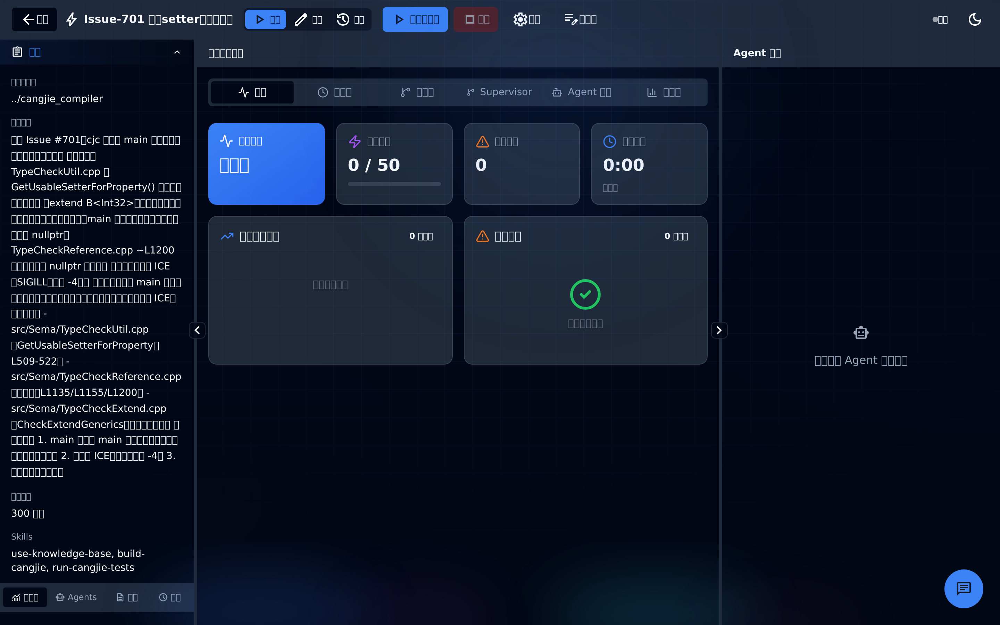
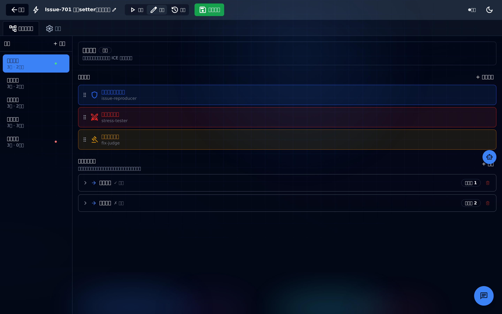
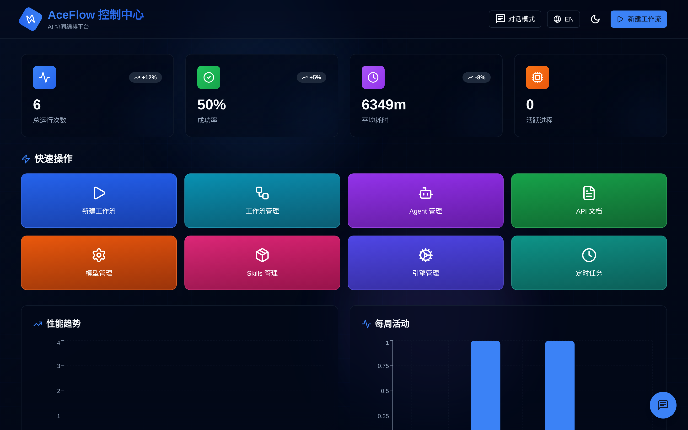

# AceFlow - 多 AI 协同工作流调度系统

<div align="center">

**企业级 AI Agent 编排平台 | 支持对抗式迭代 | 状态机工作流 | 可视化设计**

[English](./README_EN.md) | 简体中文

</div>

---

## 📖 目录

- [快速开始](#-快速开始)
- [核心功能](#-核心功能)
- [使用场景](#-使用场景)
- [系统架构](#-系统架构)
- [功能模块](#-功能模块)
- [内置 Agent](#-内置-agent)
- [内置 Skills](#-内置-skills)
- [工作流案例](#-工作流案例)
- [技术栈](#-技术栈)

---

## 🚀 快速开始

### 环境要求

- **Node.js** >= 18.0
- **npm** >= 9.0
- **Kiro CLI** 或 **Claude Code CLI** (用于执行工作流)

### 本地部署

```bash
# 1. 克隆项目
git clone <repository-url>
cd cangjie_frontend_ace

# 2. 安装依赖
npm install

# 3. 配置环境变量
cp .env.example .env.local
# 编辑 .env.local，填入你的 API Key
# ANTHROPIC_API_KEY=sk-ant-api03-你的密钥

# 4. 配置执行引擎（可选）
echo '{"engine": "kiro-cli"}' > .engine.json
# 或使用 claude-code: {"engine": "claude-code"}

# 5. 启动开发服务器
npm run dev

# 6. 访问系统
# 浏览器打开 http://localhost:3000
```

### 生产部署

```bash
# 构建生产版本
npm run build

# 启动生产服务器
npm start
```

---

## ✨ 核心功能

### 🎯 多模式工作流引擎

- **对抗式迭代工作流** - Defender/Attacker/Judge 三角色协作，自动迭代优化
- **状态机工作流** - 基于状态转移的复杂流程编排，支持条件跳转
- **传统阶段式工作流** - 线性/并行步骤组合，适合标准化流程

### 🎨 可视化设计器

- **拖拽式流程编辑** - ReactFlow 驱动的专业流程图编辑器
- **实时预览** - 所见即所得的配置体验
- **智能验证** - Zod Schema 自动校验配置合法性

### 📊 实时监控面板

- **执行状态追踪** - 实时显示每个步骤的执行进度
- **日志流式输出** - SSE 推送，毫秒级延迟
- **性能分析** - Token 用量、成本、耗时统计
- **可视化图表** - 状态转移图、时序图、Agent 流程图

### 🔄 智能调度系统

- **并发控制** - 最多 3 个进程并发，自动队列管理
- **断点续跑** - 服务重启后自动恢复执行
- **人工检查点** - 关键节点人工审批，支持反馈注入
- **定时任务** - Cron 表达式定时触发工作流

### 🛡️ 企业级特性

- **多租户隔离** - 运行记录独立存储
- **历史回溯** - 完整的执行历史和输出文件管理
- **国际化** - 中英文双语支持
- **主题切换** - 深色/浅色模式

---

## 🎯 使用场景

### 1. 代码质量保障

**场景**：自动化代码审查和优化

- **Defender Agent** - 编写代码实现功能
- **Attacker Agent** - 发现代码问题（bug、性能、安全）
- **Judge Agent** - 评估问题严重性，决定是否通过

**效果**：迭代 3-5 轮后，代码质量显著提升

### 2. 文档协同创作

**场景**：多 Agent 协作撰写技术文档

- **Writer Agent** - 撰写文档初稿
- **Reviewer Agent** - 审查内容准确性和可读性
- **Editor Agent** - 润色语言和格式

**效果**：自动生成高质量文档，减少人工修改

### 3. 测试用例生成

**场景**：自动生成全面的测试用例

- **Analyzer Agent** - 分析代码逻辑和边界条件
- **Generator Agent** - 生成测试用例
- **Validator Agent** - 验证测试覆盖率

**效果**：覆盖率提升至 90%+

### 4. 需求分析与设计

**场景**：从需求到设计方案的自动化流程

- **Analyst Agent** - 分析需求，提取关键点
- **Designer Agent** - 设计技术方案
- **Reviewer Agent** - 评审方案可行性

**效果**：快速产出高质量设计文档

### 5. 性能压测与优化

**场景**：自动化性能测试和优化建议

- **Tester Agent** - 执行压力测试
- **Analyzer Agent** - 分析性能瓶颈
- **Optimizer Agent** - 提出优化方案

**效果**：持续迭代直到性能达标

---

## 🏗️ 系统架构

```
┌─────────────────────────────────────────────────────────────┐
│                        前端层 (Next.js)                      │
├─────────────────────────────────────────────────────────────┤
│  Dashboard  │  Workbench  │  Workflows  │  Schedules  │ ... │
└─────────────────────────────────────────────────────────────┘
                              ▼
┌─────────────────────────────────────────────────────────────┐
│                      API 路由层 (Next.js API)                │
├─────────────────────────────────────────────────────────────┤
│  /api/workflow/*  │  /api/processes/*  │  /api/configs/*    │
│  /api/schedules/* │  /api/runs/*       │  /api/agents/*     │
└─────────────────────────────────────────────────────────────┘
                              ▼
┌─────────────────────────────────────────────────────────────┐
│                      业务逻辑层 (src/lib)                     │
├─────────────────────────────────────────────────────────────┤
│  WorkflowManager          │  StateMachineWorkflowManager    │
│  ProcessManager           │  RunStore                       │
│  Scheduler                │  StreamManager                  │
└─────────────────────────────────────────────────────────────┘
                              ▼
┌─────────────────────────────────────────────────────────────┐
│                    执行引擎层 (CLI 进程)                      │
├─────────────────────────────────────────────────────────────┤
│  Kiro CLI  │  Claude Code CLI  │  (可扩展其他引擎)          │
└─────────────────────────────────────────────────────────────┘
                              ▼
┌─────────────────────────────────────────────────────────────┐
│                      AI 服务层 (API)                         │
├─────────────────────────────────────────────────────────────┤
│  Anthropic Claude  │  OpenAI GPT  │  (可扩展其他模型)       │
└─────────────────────────────────────────────────────────────┘
```

### 数据流

```
用户操作 → 前端组件 → API 路由 → 业务逻辑 → 执行引擎 → AI 服务
                                      ↓
                                  SSE 推送
                                      ↓
                              实时更新前端
```

---

## 📦 功能模块

### 1. 首页 - 对话界面 (`/`)

**功能**：
- 与 AI 进行自然语言对话
- 支持多轮对话，保持上下文
- 实时流式输出
- 历史会话管理

**亮点**：
- 集成 Claude API，支持最新模型
- Markdown 渲染，代码高亮
- 会话持久化，刷新不丢失

### 2. 仪表盘 (`/dashboard`)

**功能**：
- 系统概览：运行中/已完成/失败的工作流统计
- 最近运行记录：快速查看和恢复
- 性能图表：Token 用量、成本趋势
- 活跃 Agent 状态

**亮点**：
- Recharts 可视化图表
- 实时数据刷新
- 一键跳转到工作流详情

### 3. 工作流管理 (`/workflows`)

**功能**：
- 工作流列表：显示所有配置文件
- 搜索过滤：按名称、描述、Agent 数量筛选
- 快速操作：启动、编辑、复制、删除
- 新建向导：表单式创建工作流

**亮点**：
- 卡片式布局，信息一目了然
- 批量操作支持
- 配置文件实时验证

### 4. 工作台 (`/workbench/[config]`)

**核心模块**，包含三大视图：

#### 4.1 运行视图 (Run Mode)

**功能**：
- 启动/停止工作流
- 实时监控执行状态
- 查看步骤输出和日志
- 人工检查点审批
- 断点续跑

**亮点**：
- **多标签页**：
  - 工作流总览：流程图 + 进度条
  - Agent 状态：每个 Agent 的任务和 Token 用量
  - 执行日志：分级日志（info/warning/error）
  - 步骤输出：Markdown 渲染，支持代码高亮
  - 实时流：流式输出，支持人工反馈注入
- **状态机专属视图**：
  - 状态转移时序图
  - 状态流转图
  - Supervisor 决策流程图
  - Agent 工作流图
  - 状态机拓扑图
- **智能轮询优化**：5-10 秒自适应间隔，节省 60-75% 流量
- **增量更新**：只传输新增内容，减少网络开销

#### 4.2 设计视图 (Design Mode)

**功能**：
- 可视化编辑工作流
- 拖拽排序步骤
- 配置并行分组
- 设置迭代参数
- 实时预览流程图

**亮点**：
- ReactFlow 驱动的专业编辑器
- 支持跨阶段移动步骤
- 自动生成 YAML 配置
- Zod Schema 实时验证

#### 4.3 历史视图 (History Mode)

**功能**：
- 查看所有历史运行记录
- 按状态筛选（成功/失败/停止）
- 查看每次运行的详细输出
- 恢复失败的运行
- 批量删除记录

**亮点**：
- 完整的执行历史追溯
- 输出文件管理（查看/下载/删除）
- 文档管理（重命名/删除）
- 运行分析：Prompt 分析、成本统计

### 5. 定时任务 (`/schedules`)

**功能**：
- 创建定时任务：Cron 表达式配置
- 启用/禁用任务
- 手动触发任务
- 查看执行历史

**亮点**：
- node-cron 驱动，支持标准 Cron 语法
- 任务状态实时同步
- 执行日志完整记录

### 6. Skills 管理 (`/skills`)

**功能**：
- 查看所有可用 Skills
- 查看 Skill 详细文档
- 测试 Skill 功能

**亮点**：
- 模块化 Skill 设计
- 支持自定义 Skill 扩展

### 7. 模型管理 (`/models`)

**功能**：
- 查看支持的 AI 模型列表
- 配置模型参数
- 测试模型连接

**亮点**：
- 支持多模型切换
- 模型性能对比

### 8. API 文档 (`/api-docs`)

**功能**：
- 完整的 API 接口文档
- 请求/响应示例
- 在线测试工具

**亮点**：
- 自动生成文档
- 交互式 API 测试

---

## 🤖 内置 Agent

系统预置了多个专业 Agent，覆盖不同场景：

### 1. **Code Hunter** (`code-hunter.yaml`)
- **角色**：代码分析专家
- **能力**：深度分析代码结构、发现潜在问题
- **模型**：Claude Sonnet 4.6
- **适用场景**：代码审查、重构建议

### 2. **Fix Hunter** (`fix-hunter.yaml`)
- **角色**：Bug 猎手
- **能力**：定位和修复代码缺陷
- **模型**：Claude Sonnet 4.6
- **适用场景**：Bug 修复、问题排查

### 3. **Fix Breaker** (`fix-breaker.yaml`)
- **角色**：修复验证者
- **能力**：验证修复方案的有效性
- **模型**：Claude Sonnet 4.6
- **适用场景**：修复验证、回归测试

### 4. **Design Breaker** (`design-breaker.yaml`)
- **角色**：设计评审专家
- **能力**：评估设计方案的合理性
- **模型**：Claude Sonnet 4.6
- **适用场景**：架构评审、设计优化

### 5. **Performance Breaker** (`performance-breaker.yaml`)
- **角色**：性能测试专家
- **能力**：发现性能瓶颈，提出优化建议
- **模型**：Claude Sonnet 4.6
- **适用场景**：性能优化、压力测试

### 6. **Stress Tester** (`stress-tester.yaml`)
- **角色**：压力测试工程师
- **能力**：执行高强度测试，评估系统稳定性
- **模型**：Claude Sonnet 4.6
- **适用场景**：负载测试、稳定性验证

### 7. **Oh Cangjie Analyst** (`oh-cangjie-analyst.yaml`)
- **角色**：仓颉语言专家
- **能力**：分析仓颉代码，提供优化建议
- **模型**：Claude Opus 4.6
- **适用场景**：仓颉项目开发、代码优化

---

## 🛠️ 内置 Skills

Skills 是可复用的能力模块，Agent 可以调用这些 Skills 完成特定任务：

### 1. **use-knowledge-base**
- **功能**：知识库检索和问答
- **能力**：
  - 索引文档内容
  - 语义搜索
  - 上下文问答
- **适用场景**：文档查询、知识管理

### 2. **xlsx**
- **功能**：Excel 文件处理
- **能力**：
  - 读取/写入 Excel
  - 数据转换
  - 表格分析
- **适用场景**：数据处理、报表生成

### 3. **webapp-testing**
- **功能**：Web 应用自动化测试
- **能力**：
  - UI 测试
  - API 测试
  - 性能测试
- **适用场景**：自动化测试、质量保障

### 4. **skill-creator**
- **功能**：创建自定义 Skill
- **能力**：
  - Skill 模板生成
  - 配置文件生成
  - 文档生成
- **适用场景**：Skill 扩展开发

### 5. **mcp-builder**
- **功能**：MCP (Model Context Protocol) 服务构建
- **能力**：
  - Node.js MCP 服务生成
  - Python MCP 服务生成
  - 协议实现
- **适用场景**：MCP 服务开发

### 6. **doc-coauthoring**
- **功能**：文档协同创作
- **能力**：
  - 多人协作
  - 版本管理
  - 冲突解决
- **适用场景**：团队文档编写

### 7. **claude-api**
- **功能**：Claude API 调用封装
- **能力**：
  - API 请求封装
  - 错误处理
  - 重试机制
- **适用场景**：Claude API 集成

### 8. **power-gitcode**
- **功能**：Git 代码管理增强
- **能力**：
  - 代码提交分析
  - 分支管理
  - 代码审查
- **适用场景**：代码版本管理

### 9. **aceflow-workflow-creator**
- **功能**：AceFlow 工作流创建器
- **能力**：
  - 工作流模板生成
  - 配置验证
  - 最佳实践推荐
- **适用场景**：快速创建工作流

### 10. **aceflow-chat-card**
- **功能**：对话卡片组件
- **能力**：
  - 富文本渲染
  - 交互式组件
  - 自定义样式
- **适用场景**：对话界面增强

---

## 📋 工作流案例

### 案例 1：修复 Issue 701 (`fix-issue-701.yaml`)

**场景**：自动修复 GitHub Issue

**流程**：
```
State: analyze_issue
  ├─ Step: read_issue (oh-cangjie-analyst)
  └─ Step: identify_root_cause (oh-cangjie-analyst)
       ↓
State: propose_fix
  ├─ Step: design_solution (code-hunter)
  └─ Step: implement_fix (code-hunter)
       ↓
State: verify_fix
  ├─ Step: run_tests (stress-tester)
  └─ Step: validate_solution (fix-breaker)
       ↓
State: completed (if tests pass)
State: failed (if tests fail)
```

**特点**：
- 状态机模式，支持条件跳转
- 自动化测试验证
- 失败自动回退

### 案例 2：修复 Issue 746 (`fix-issue-746.yaml`)

**场景**：复杂 Bug 修复流程

**流程**：
```
Phase 1: Analysis
  ├─ Step: analyze_code (code-hunter)
  └─ Step: reproduce_bug (stress-tester)

Phase 2: Fix (Iterative, max 3 rounds)
  ├─ Step: propose_fix (fix-hunter) [Defender]
  ├─ Step: review_fix (fix-breaker) [Attacker]
  └─ Step: judge_quality (design-breaker) [Judge]
       ↓ (iterate if not pass)

Phase 3: Verification
  ├─ Step: integration_test (stress-tester)
  └─ Step: performance_test (performance-breaker)
```

**特点**：
- 对抗式迭代，确保修复质量
- 多轮迭代，最多 3 轮
- 人工检查点，关键节点人工审批

### 案例 3：仓颉开发工作流 (`oh-cangjiedev-sm.yaml`)

**场景**：仓颉语言项目开发

**流程**：
```
State: planning
  └─ Step: analyze_requirements (oh-cangjie-analyst)
       ↓
State: development
  ├─ Step: write_code (oh-cangjie-analyst)
  └─ Step: write_tests (oh-cangjie-analyst)
       ↓
State: review (Iterative)
  ├─ Step: code_review (code-hunter)
  └─ Step: test_review (stress-tester)
       ↓ (iterate if issues found)
State: deployment
  └─ Step: deploy (oh-cangjie-analyst)
```

**特点**：
- 专为仓颉语言优化
- 代码和测试并行开发
- 自动化代码审查

### 案例 4：全流程设计工作流 (`full-design.yaml`)

**场景**：从需求到设计的完整流程

**流程**：
```
Phase 1: Requirement Analysis
  └─ Step: analyze (oh-cangjie-analyst)

Phase 2: Design (Iterative, max 5 rounds)
  ├─ Step: design_architecture (code-hunter) [Defender]
  ├─ Step: find_issues (design-breaker) [Attacker]
  └─ Step: evaluate (oh-cangjie-analyst) [Judge]

Phase 3: Documentation
  └─ Step: write_docs (oh-cangjie-analyst)
```

**特点**：
- 最多 5 轮迭代，确保设计质量
- 架构评审自动化
- 自动生成设计文档

### 案例 5：Mimalloc 优化工作流 (`workflow-mimalloc-v2.yaml`)

**场景**：内存分配器性能优化

**流程**：
```
Phase 1: Baseline Testing
  └─ Step: benchmark (performance-breaker)

Phase 2: Optimization (Iterative, max 10 rounds)
  ├─ Step: propose_optimization (code-hunter) [Defender]
  ├─ Step: test_performance (performance-breaker) [Attacker]
  └─ Step: evaluate_improvement (stress-tester) [Judge]

Phase 3: Final Validation
  └─ Step: stress_test (stress-tester)
```

**特点**：
- 最多 10 轮迭代，持续优化
- 性能基准对比
- 压力测试验证

---

## 🔧 技术栈

### 前端框架
- **Next.js 16** - React 框架，App Router + API Routes
- **React 18** - UI 库
- **TypeScript 5** - 类型安全

### UI 组件
- **Tailwind CSS 3** - 实用优先的 CSS 框架
- **Shadcn/ui** - 基于 Radix UI 的高质量组件库
- **Radix UI** - 无头 UI 原语
- **Framer Motion 12** - 动画库
- **Lucide React** - 图标库

### 可视化
- **ReactFlow 11** - 专业流程图可视化
- **Recharts 3** - React 图表库

### 表单与验证
- **React Hook Form 7** - 高性能表单管理
- **Zod 3** - TypeScript-first Schema 验证

### 拖拽功能
- **@dnd-kit** - 拖拽核心库 + 可排序列表

### 内容处理
- **React Markdown 10** - Markdown 渲染
- **Remark GFM 4** - GitHub Flavored Markdown
- **React Syntax Highlighter 16** - 代码语法高亮

### 国际化与主题
- **next-intl 4** - i18n 支持（中英文）
- **next-themes 0.4** - 深色/浅色主题切换

### 数据与配置
- **YAML 2.3** - 配置文件解析
- **node-cron 4.2** - Cron 任务调度

### 工具库
- **clsx** - 条件类名工具
- **class-variance-authority** - 组件变体管理
- **tailwind-merge** - Tailwind 类名合并

---

## 📝 配置说明

### 环境变量 (`.env.local`)

```bash
# Anthropic API (必填)
ANTHROPIC_API_KEY=sk-ant-api03-你的密钥

# Anthropic API 自定义地址（可选，用于代理）
ANTHROPIC_BASE_URL=https://your-gateway.com/v1

# 请求超时（毫秒，可选）
ANTHROPIC_TIMEOUT=120000

# OpenAI API（使用 OpenAI 模型时）
OPENAI_API_KEY=sk-...
OPENAI_BASE_URL=https://your-proxy.com/v1

# 前端 API 根路径（前后端分离时）
NEXT_PUBLIC_API_BASE=https://api.example.com
```

### 执行引擎配置 (`.engine.json`)

```json
{
  "engine": "kiro-cli"
}
```

支持的引擎：
- `kiro-cli` - Kiro CLI（推荐）
- `claude-code` - Claude Code CLI

### 工作流配置 (YAML)

```yaml
name: "示例工作流"
description: "工作流描述"
version: "1.0.0"

context:
  projectRoot: "/path/to/project"
  requirements: "需求描述"
  timeoutMinutes: 30
  skills:
    - use-knowledge-base
    - power-gitcode

workflow:
  mode: "state-machine"  # 或 "adversarial-iterative"

  states:
    - name: "state_name"
      description: "状态描述"
      steps:
        - name: "step_name"
          agent: "agent_name"
          prompt: "步骤提示词"
      transitions:
        - condition: "success"
          target: "next_state"
        - condition: "failure"
          target: "error_state"
```

---

## 🎨 系统截图

### 工作台 - 运行视图


### 工作台 - 设计视图


### 状态机可视化


### 仪表盘


---

## 🤝 贡献指南

欢迎贡献代码、报告问题或提出建议！

### 开发流程

```bash
# 1. Fork 项目
# 2. 创建特性分支
git checkout -b feature/your-feature

# 3. 提交代码（遵循 commitlint 规范）
git commit -m "feat: add new feature"

# 4. 推送到分支
git push origin feature/your-feature

# 5. 创建 Pull Request
```

### Commit 规范

遵循 [Conventional Commits](https://www.conventionalcommits.org/)：

- `feat:` - 新功能
- `fix:` - Bug 修复
- `docs:` - 文档更新
- `style:` - 代码格式调整
- `refactor:` - 代码重构
- `perf:` - 性能优化
- `test:` - 测试相关
- `chore:` - 构建/工具链相关

---

## 📄 许可证

MIT License

---

## 🔗 相关链接

- [Anthropic Claude](https://www.anthropic.com/claude)
- [Next.js 文档](https://nextjs.org/docs)
- [ReactFlow 文档](https://reactflow.dev/)
- [Shadcn/ui 文档](https://ui.shadcn.com/)

---

## 💬 联系我们

- **Issues**: [GitHub Issues](https://github.com/your-repo/issues)
- **Discussions**: [GitHub Discussions](https://github.com/your-repo/discussions)

---

<div align="center">

**⭐ 如果这个项目对你有帮助，请给我们一个 Star！**

Made with ❤️ by AceFlow Team

</div>
