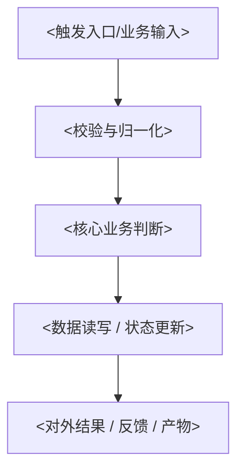

# Design: <change-id>

## Overview

用 3 到 6 句话交代这次方案的目标、主链路、受影响对象、总体实现思路和需要用户确认的执行边界。先记录上下文证据，再给出方案，不要在事实不足时直接跳到实现细节。

## Context Snapshot

- 用户目标：<用户明确要求达成的结果>
- 相关证据：<已读取的规范、代码、数据、错误或对话事实>
- 非目标：<本 change 明确不处理的范围>
- 执行门禁：<哪些步骤必须等用户/owner 批准后才能实施>

## Technical Approach

描述实现这次变更的总体技术路径。这里可以写模块边界、数据流、状态流、迁移方式和集成点，但不要把每一步执行事项写成任务清单。

要求：

- 明确从输入到输出的主链路
- 设计内容要严格贴合当前业务，不写与本次目标无关的通用架构陈词
- 直接点名真实入口、真实状态来源、真实副作用、真实落盘位置、真实展示位置
- 如果某个真实对象还没确认，写成“待确认项”，不要用泛词替代

## Architecture


要求：

- 这张图必须能看出谁触发、谁处理、谁持久化、谁对外展示或返回结果
- 不要保留纯占位图；如果没有替换成真实节点名称，这份设计视为未完成

## Core Components

### 1. <component-name>

- 职责：<负责什么>
- 输入：<接收什么>
- 输出：<产出什么>
- 关键约束：<必须满足什么>
- 所在位置：<模块 / 文件 / 子系统 / 运行层次>

### 2. <component-name>

- 职责：<负责什么>
- 输入：<接收什么>
- 输出：<产出什么>
- 关键约束：<必须满足什么>

## Current State

- 现有入口：<相关页面、API、CLI、配置或后台任务>
- 现有数据：<当前存储、schema、文件格式或运行态对象>
- 现有约束：<权限、兼容性、性能、环境、版本或历史行为>

## Target State

- 目标入口：<变更后用户或系统从哪里触发>
- 目标数据：<变更后数据如何表达和持久化>
- 目标行为：<变更后外部可观察行为>

## Data Models

- `<model-name>`：<字段、结构、约束、来源和用途>
- `<model-name>`：<字段、结构、约束、来源和用途>

要求：

- 至少写出关键字段，而不是只写“包含必要元数据”
- 如果会新增状态枚举、任务状态、修订记录、显示字段，必须明确列出

## Interfaces And Contracts

- 入口契约：<调用方提供什么，系统返回什么>
- 内部契约：<模块之间如何交互>
- 错误契约：<失败时怎样暴露、记录或恢复>

要求：

- 如果涉及 API，尽量写出 path、主要请求字段、主要响应字段、错误分支
- 如果涉及 UI 事件，写清楚触发源、状态变化和显示反馈
- 如果涉及文件/文档制品，写清楚命名规则、目录规则和更新时机

## Data Flow



要求：

- 数据流图必须体现至少一个校验点、一个核心判断点、一个状态或数据写入点
- 如果存在失败路径、回滚、降级或人工确认，尽量在图中显式画出分支

## Core Logic Pseudocode

```text
function handleBusinessFlow(input):
  validate input and required context
  load current state and related business objects
  evaluate business rules and boundary conditions
  branch on key decisions
  persist accepted changes
  emit user-visible result and validation evidence
```

要求：

- 伪代码里的分支要对应真实业务规则，而不是空泛模板
- 如果存在多阶段处理，按阶段展开关键判定和数据变化
- 不能保留模板函数名或模板步骤；必须替换成当前业务里的真实入口、真实判断和真实副作用

## Assumptions And Unknowns

- 已确认事实：<可以直接依赖的事实>
- 当前假设：<尚待验证，但当前设计依赖的判断>
- 待确认问题：<需要进一步确认的问题>

## Key Decisions

### Decision: <decision-name>

选择：<选择的方案>

原因/证据：

- <为什么这个方案符合当前架构>
- <为什么它比备选方案更适合本次范围>
- <依赖了哪些已确认事实、代码证据或用户输入>

拒绝的替代方案：

- <替代方案 A>：<为什么不选>
- <替代方案 B>：<为什么不选>

风险/权衡：

- <该方案带来的限制、成本或后续维护点>
- <哪些情况下可能需要回退或重构>

### Decision: <another-decision-name>

选择：<选择的方案>

原因/证据：

- <依赖的事实、约束或需求>
- <为什么该选择最符合本次边界>

拒绝的替代方案：

- <替代方案>：<为什么不选>

风险/权衡：

- <限制、成本或失败模式>

### Decision: <third-decision-name>

选择：<选择的方案>

原因/证据：

- <依赖的事实、约束或需求>
- <为什么该选择最符合验证和交付要求>

拒绝的替代方案：

- <替代方案>：<为什么不选>

风险/权衡：

- <限制、成本或失败模式>

## Permissions And Ownership

- 普通执行单元：<只能更新哪些状态、进度或输出>
- Supervisor / owner：<可以修订哪些规范、设计、任务或分工>
- 用户：<哪些地方必须等待用户确认>

## Affected Areas

- `<path-or-module>`：<影响说明>
- `<path-or-module>`：<影响说明>
- 数据/配置：<schema、配置文件、运行态状态或迁移说明>
- UI/API：<可见入口、请求响应或展示变化>

## Migration And Compatibility

- 旧数据处理：<如何读取、升级或兜底>
- 新数据写入：<何时写入，如何避免破坏旧流程>
- 回滚策略：<失败后如何恢复或降级>

## Validation

- 类型检查：<命令或检查方式>
- 单元/集成测试：<命令或覆盖点>
- 手工验证：<关键用户流程>
- 数据验证：<schema、文件格式或校验脚本>

要求：

- 每类验证都尽量对应具体需求或任务，不要只列命令名
- 如果某条验证暂时做不到，写清楚替代证据

## Consistency Checklist

- 本设计覆盖的需求编号：<例如 Requirement 1, 2, 4>
- 尚未覆盖或需要额外说明的需求：<编号 + 原因>
- 依赖假设是否已显式写出：<是 / 否，若否请补齐>

## Implementation Notes

- 受影响模块：<模块或目录>，改动原因：<为什么必须改这里>
- 新增数据或接口：<字段、格式、约束>
- 兼容处理：<旧数据、旧入口、降级路径>
- 落地顺序：<推荐的实现顺序，确保每一步都能验证>

## Implementation Strategy

### Phase 1: <阶段名>

- 目标：<这一阶段解决什么问题>
- 主要动作：<要完成什么>
- 阶段产物：<产出什么>

### Phase 2: <阶段名>

- 目标：<这一阶段解决什么问题>
- 主要动作：<要完成什么>
- 阶段产物：<产出什么>

## Risks And Tradeoffs

1. <风险或不确定性>
2. <风险或不确定性>
3. <性能、安全、权限或一致性风险>
